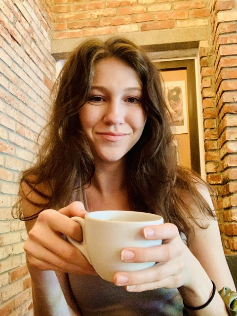
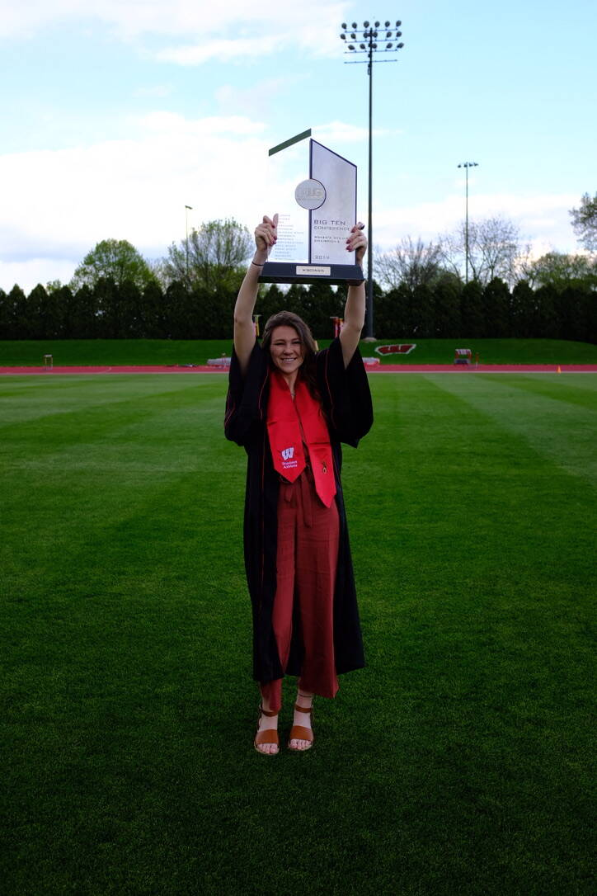

```{=html}
<div class="main-wrapper">
  <div class="content-wrapper">
    <!-- Photo Grid Section -->
    <section class="lab-section">
      <div class="fun-photo-grid">
        <figure class="fun-grid-item">
          
          <figcaption>Still searching for the best oat cappucino in Brooklyn..</figcaption>
        </figure>
        
        <figure class="fun-grid-item">
          
          <figcaption>Recent travels down under! 🇳🇿</figcaption>
        </figure>
        
        <figure class="fun-grid-item">
          
          <figcaption>Dipping back into the fiddle</figcaption>
        </figure>
      </div>
    </section>

    <!-- Athletics Section -->
    <section class="lab-section">
      <div class="two-column-layout">
        <div class="content-column">
          <h3>Just a washed-up Wisconsin Badger...</h3>
          <ul>
            <li>4-year Varsity Womans Soccer at University of Wisconsin – Madison</li>
            <li>NCAA Sweet 16 (2018, 2019, 2020)</li>
            <li>Elected for Big Ten Conference's 'Return to Play' Taskforce after COVID-19</li>
          </ul>
          
          <div class="video-container">
            <iframe src="https://www.youtube.com/embed/ET7_4_DdUs8" allowfullscreen></iframe>
          </div>
          
          <a href="https://engineering.wisc.edu/news/soccer-standout-douglas-industrious-field-classroom/"
             class="button-link"
             target="_blank">
             UW-Madison SOE article
          </a>
        </div>
        <div class="image-column">
          <div class="sticky-images">
            <figure class="image-item">
              
              <figcaption class="image-caption">Won Big Ten Conference Title (2019) !</figcaption>
            </figure>
          </div>
        </div>
      </div>
    </section>

    <!-- 3D Models Section -->
    <section class="lab-section">
      <div class="two-column-layout">
        <div class="content-column">
          <h3>3D Models of Friends</h3>
          <p>Using photogrammetry techniques to create 3D models of friends and family. Each model is created from hundreds of photos processed through specialized software.</p>
          
          <ul>
            <li>Capture Setup: DSLR camera with controlled lighting</li>
            <li>Processing: Agisoft Metashape for photogrammetry</li>
            <li>Post-processing: Blender for mesh cleanup and texturing</li>
          </ul>
        </div>
        <div class="image-column">
          <div class="project-gallery">
            <div class="gallery-images" id="models-gallery">
              <figure>
                
                <figcaption class="image-caption">3D scan of friend during soccer practice</figcaption>
              </figure>
              <figure>
                
                <figcaption class="image-caption">Family portrait in 3D</figcaption>
              </figure>
            </div>
            <div class="gallery-nav" id="models-nav">
              <span class="gallery-dot"></span>
              <span class="gallery-dot"></span>
            </div>
          </div>
        </div>
      </div>
    </section>

    <!-- Health Tracking Section -->
    <section class="lab-section">
      <div class="two-column-layout">
        <div class="content-column">
          <h3>go go garmin</h3>
          <p>I'm most comfortable moving! I wear a Garmin Forerunner 245 to track daily physiological measures such as heart rate, stress, sleep, steps, or other activities.</p>
        </div>
        <div class="image-column">
          <div class="project-gallery">
            <div class="gallery-images" id="health-gallery">
              <figure>
                
                <figcaption class="image-caption">Custom activity dashboard showing weekly trends</figcaption>
              </figure>
              <figure>
                
                <figcaption class="image-caption">Training load analysis over time</figcaption>
              </figure>
            </div>
            <div class="gallery-nav" id="health-nav">
              <span class="gallery-dot"></span>
              <span class="gallery-dot"></span>
            </div>
          </div>
        </div>
      </div>
    </section>
  </div>
</div>

<script type="text/javascript">
document.addEventListener('DOMContentLoaded', () => {
  class ImageGallery {
    constructor(container) {
      this.gallery = container;
      this.figures = this.gallery.querySelectorAll('figure');
      this.nav = this.gallery.nextElementSibling;
      this.dots = this.nav.querySelectorAll('.gallery-dot');
      this.currentIndex = 0;
      
      this.showImage(0);
      this.setupEventListeners();
    }
    
    showImage(index) {
      if (index < 0 || index >= this.figures.length) return;
      
      this.figures.forEach(fig => {
        fig.style.display = 'none';
        fig.classList.remove('active');
      });
      
      this.figures[index].style.display = 'block';
      this.figures[index].classList.add('active');
      
      this.dots.forEach(dot => dot.classList.remove('active'));
      if (this.dots[index]) {
        this.dots[index].classList.add('active');
      }
      
      this.currentIndex = index;
    }
    
    setupEventListeners() {
      this.dots.forEach((dot, index) => {
        dot.addEventListener('click', () => this.showImage(index));
      });
      
      let touchStartX = 0;
      let touchEndX = 0;
      
      this.gallery.addEventListener('touchstart', (e) => {
        touchStartX = e.touches[0].clientX;
      }, { passive: true });
      
      this.gallery.addEventListener('touchend', (e) => {
        touchEndX = e.changedTouches[0].clientX;
        const swipeDistance = touchStartX - touchEndX;
        const swipeThreshold = 50;
        
        if (Math.abs(swipeDistance) > swipeThreshold) {
          if (swipeDistance > 0 && this.currentIndex < this.figures.length - 1) {
            this.showImage(this.currentIndex + 1);
          } else if (swipeDistance < 0 && this.currentIndex > 0) {
            this.showImage(this.currentIndex - 1);
          }
        }
      }, { passive: true });
    }
  }

  const galleries = document.querySelectorAll('.gallery-images');
  galleries.forEach(gallery => {
    new ImageGallery(gallery);
  });
});
</script>
```
