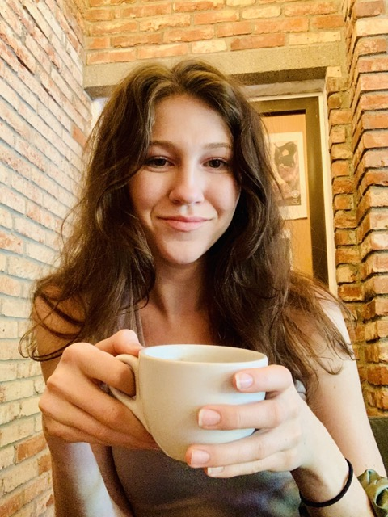
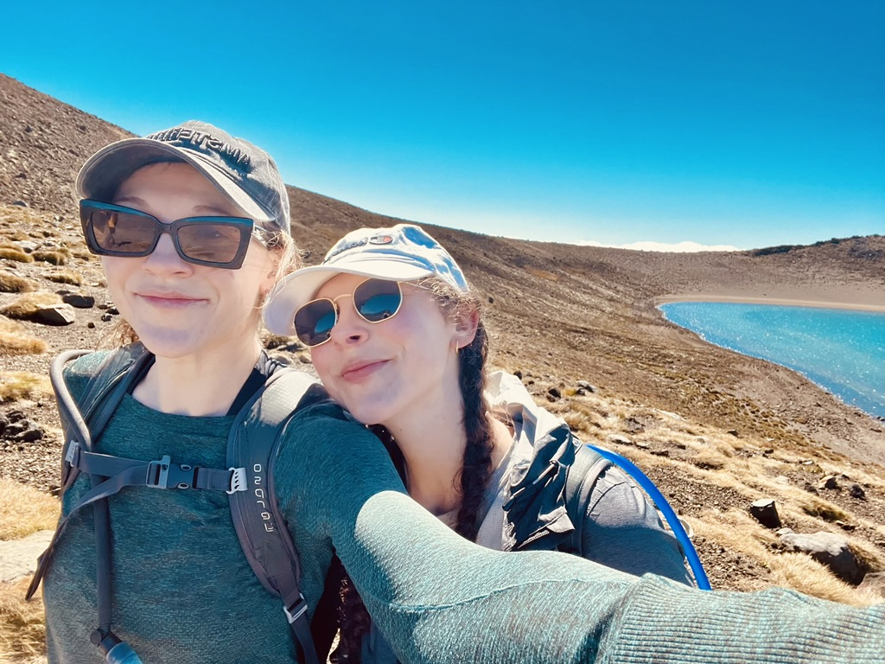
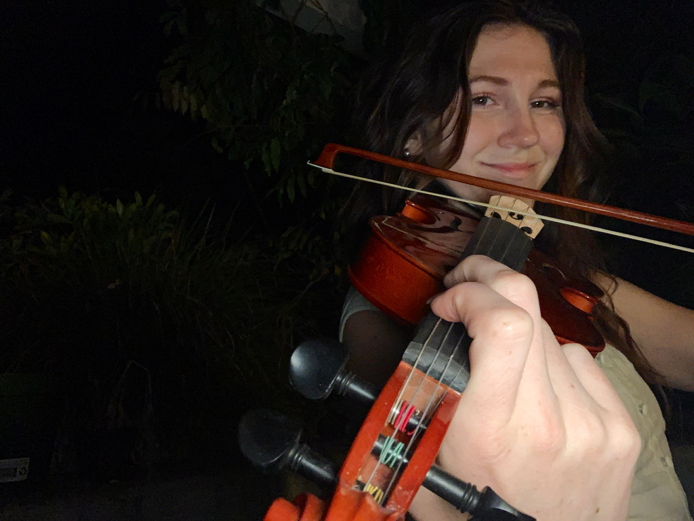
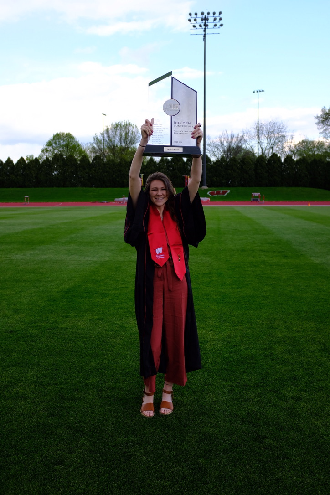
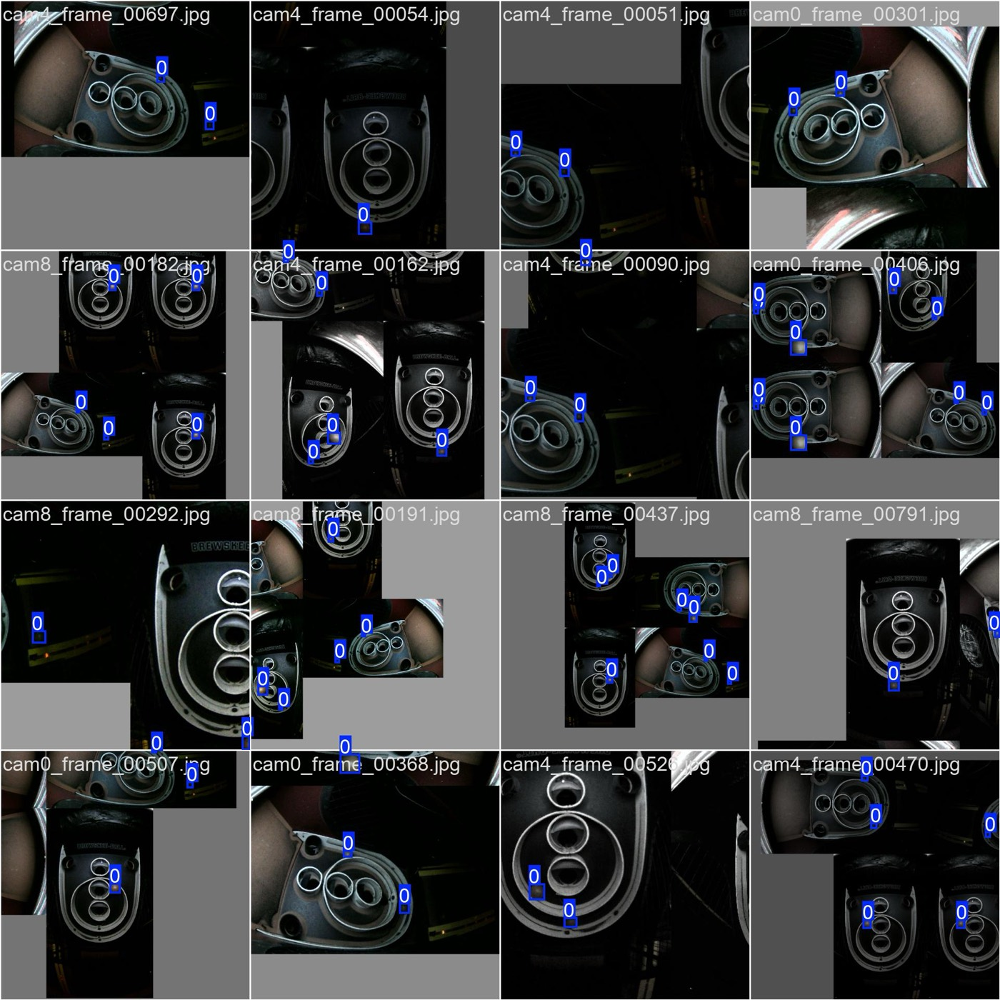

```{=html}
<div class="main-wrapper">
  <div class="content-wrapper">
    <!-- Photo Grid Section -->
    <section class="lab-section">
      <div class="three-column-grid"> <!-- Changed to match other grid structures -->
        <figure class="grid-item"> <!-- Changed to be consistent with other grids -->
          
          <figcaption>Still searching for the best oat cappucino in Brooklyn..</figcaption>
        </figure>
        
        <figure class="grid-item">
          
          <figcaption>Recent travels down under! 🇳🇿</figcaption>
        </figure>
        
        <figure class="grid-item">
          
          <figcaption>Dipping back into the fiddle</figcaption>
        </figure>
      </div>
    </section>

    <!-- Athletics Section -->
    <section class="lab-section">
      <div class="two-column-layout">
        <div class="content-column">
          <h3>On Wisconsin! ⚽️</h3>
          <ul>
            <li>4-year Varsity Womans Soccer at University of Wisconsin – Madison</li>
            <li>NCAA Sweet 16 (2018, 2019, 2020)</li>
            <li>Elected for Big Ten Conference's 'Return to Play' Taskforce after COVID-19</li>
          </ul>
                    <!-- For centered button -->
          <a href="https://engineering.wisc.edu/news/soccer-standout-douglas-industrious-field-classroom/"
             class="button-link centered"
             target="_blank">
             UW-Madison SOE article
          </a>
          <div class="video-container">
            <iframe src="https://www.youtube.com/embed/ET7_4_DdUs8" allowfullscreen></iframe>
          </div>
        </div>
        <div class="image-column">
          <div class="sticky-images">
            <figure class="image-item">
              
              <figcaption class="image-caption">Won Big Ten Conference Title (2019) !</figcaption>
            </figure>
          </div>
        </div>
      </div>
    </section>

    <!-- Health Tracking Section -->
    <section class="lab-section">
      <h3>go go garmin</h3>
      <p>I'm most comfortable moving. A Garmin Forerunner 245 logs the daily damage &mdash; heart rate, stress, sleep, steps &mdash; and a scheduled job pulls it into this page every morning, so the numbers below are however I actually did this week rather than a screenshot from a good one.</p>
      <div id="health-dashboard" class="hd-root">
        <p class="hd-stamp">Loading&hellip;</p>
      </div>
    </section>

    <!-- Ferret Tracking Section -->
    <section class="lab-section">
      <div class="two-column-layout">
        <div class="content-column">
          <h3>Six ferrets, one camera 🦦</h3>
          <p>I work with the <a href="https://med.emory.edu/" target="_blank" rel="noopener">Lakdawala Lab</a> at Emory University School of Medicine on something a long way from traffic: tracking ferrets in influenza-transmission studies. Ferrets are the standard model for how flu moves between hosts, and the question is who contacted whom, for how long &mdash; which means you have to keep five or six of them straight on video, continuously, while they pile on top of each other in a corner and sleep.</p>

          <p>Pose estimation handles the bodies. Identity is the hard part: every existing approach ties who-you-are to where-your-joints-are, so the moment two animals overlap, the labels swap and stay swapped for the rest of the video. Working with <a href="https://sleap.ai/" target="_blank" rel="noopener">SLEAP</a>'s creator Dr. Talmo Pereira, we pulled identity apart from pose &mdash; a Random Forest classifier reads the dye markings straight off the coat in HSV, and Hungarian matching assigns animals frame to frame.</p>

          <p>The part I like most is that it's allowed to give up. Assignment is gated on both confidence and margin, so when the model isn't sure it abstains instead of guessing &mdash; because one confident wrong guess under occlusion poisons every frame after it. The whole thing runs on an AWS GPU pipeline that streams a 2-hour video in about 1.5 hours at flat memory.</p>

          <p style="font-size: 0.9em;"><em>Protocol paper in preparation for PLOS Biology.</em></p>
        </div>
        <div class="image-column">
          <figure style="margin: 0;">
            <video class="autoloop" muted loop playsinline controls preload="metadata"
                   style="width: 100%; height: auto; max-height: 460px; object-fit: contain;">
              <source src="videos/sleap-ferret-tracking.mp4" type="video/mp4">
              Your browser does not support the video tag.
            </video>
            <figcaption class="image-caption">
              Multi-animal pose and identity tracking, holding through occlusion.
            </figcaption>
          </figure>
        </div>
      </div>
    </section>

    <!-- BrewVision Section -->
    <section class="lab-section">
      <div class="two-column-layout">
        <div class="content-column">
          <h3>BrewVision: teaching a computer to watch skee-ball 🎳</h3>
          <p>I roll in the <a href="https://www.brewskeeball.com/" target="_blank" rel="noopener">BrEWSKEE-BALL&reg;</a> league at <a href="https://www.fullcirclebar.com/brooklyn" target="_blank" rel="noopener">Full Circle Bar</a> in Williamsburg. I got to know the owner, one thing led to another, and now I am helping build the computer vision system that scores the lanes.</p>

          <p>Two cameras watch each lane &mdash; one overhead, one angled &mdash; and a YOLO detector picks the ball out of every frame. A Kalman filter carries it up the ramp, the two views agree on which ball is which, and the score comes from wherever the ball was last seen before it vanished into a cup. No sensors in the lane, no beam breaks. Just watching, the way a person would.</p>

          <p>The delightful failure mode is the hundo. Sinking the 100 means throwing hard, and throwing hard is exactly when the overhead camera loses the ball at the frame edge and the angled camera decides this must be some <em>other</em> ball &mdash; two cameras, two IDs, one very annoyed player. Also unsolved: the system has no concept of a gutter ball, and no idea that a 10th ball doesn't count. Though honestly, tracking who racks up the most meaningless 10th balls might be the best stat in the league.</p>
        </div>
        <div class="image-column">
          <figure style="margin: 0;">
            
            <figcaption class="image-caption">
              A training batch: every ball on the lane, boxed and labeled.
            </figcaption>
          </figure>
        </div>
      </div>
    </section>

  </div>
</div>
```

```{=html}
<script src="scripts/health-dashboard.js" defer></script>
```
