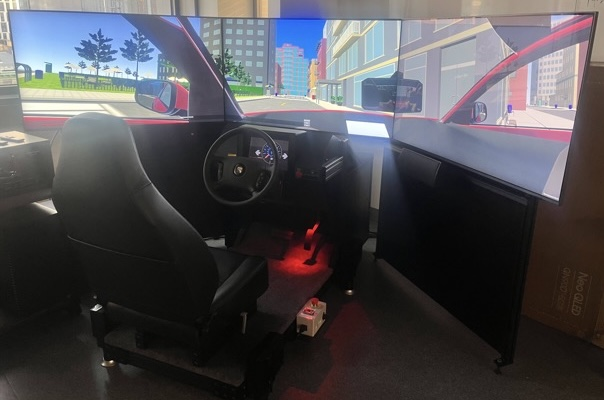
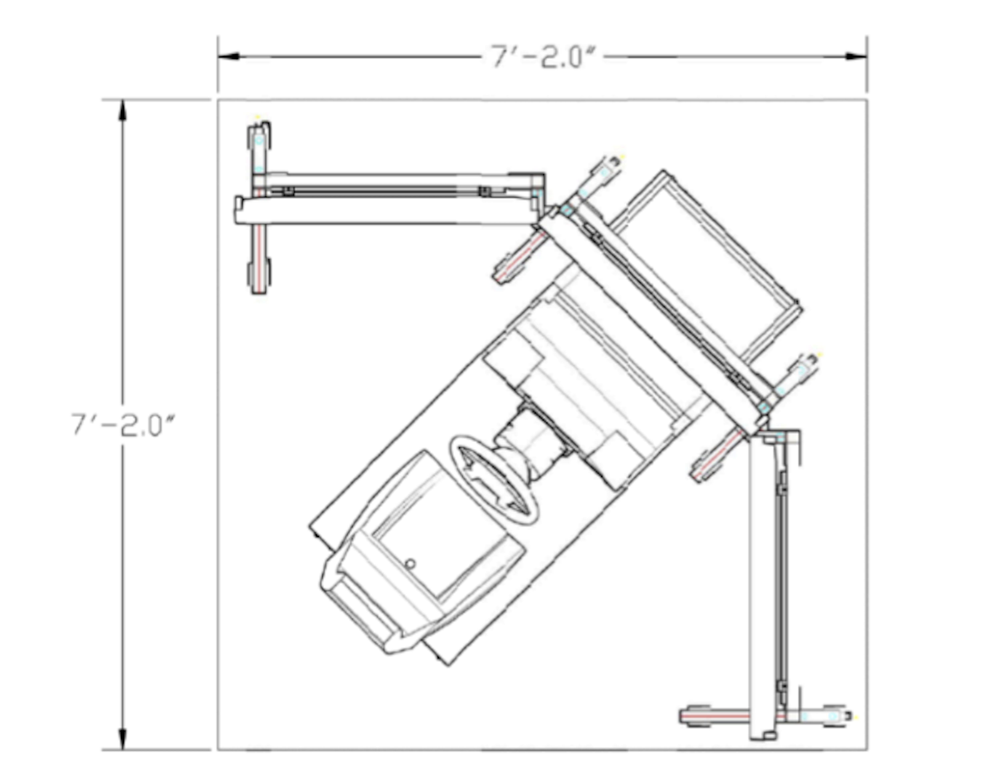
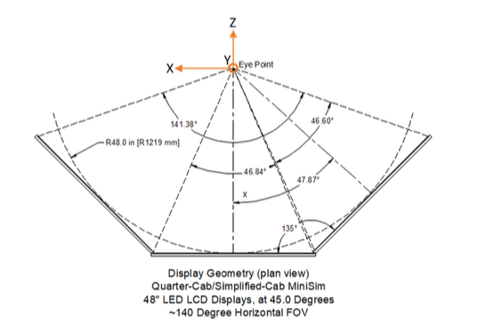
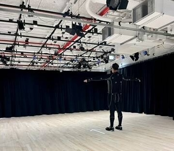
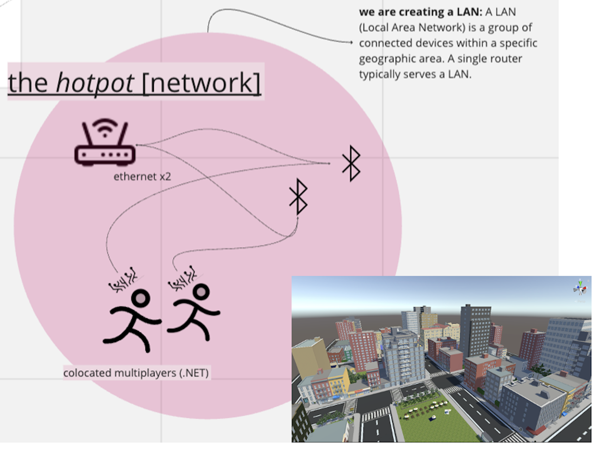

```{=html}
<div class="main-wrapper">
  <div class="content-wrapper">
    <!-- Introduction -->
    <section class="lab-section">
      <div class="intro-box">
       <div class="intro-box-title">
         <span class="emoji">💡</span>DID YA KNOW?
       </div>
       <div class="intro-box-content" style="--n:670;">
         To ensure safe experimentation settings for human-subjects, driving studies often use a combination of hardware and software tools to develop simulated road settings for controlled experimentation. Simulated environments serve as experimental testbeds that allow researchers to systematically manipulate traffic conditions, road infrastructure, and interaction scenarios while ensuring participant safety during potentially hazardous driving situations. This is particularly crucial when studying mixed-traffic interactions in shared urban spaces, where multiple types of road users—motorized and nonmotorized- navigate complex social and physical environments together.
       </div>
      </div>

    <div class="overview-text">
      Most my experimentation is done in a virtual environment. I use <a href="https://github.com/FAR-Lab/CrossCulturalDriving"><em>Strangeland</em></a> - a Unity-based multiplayer driving simulator where participants can be drivers, pedestrians, or cyclists, all interacting in the same virtual space. These tools allow us to simultaneously capture and cast behavior from multiple road users to eachother in commmon virtual worlds. This real-time synchronization between co-located human-subjects contributes to current novel representations of mixed-traffic driving environments under controlled experimentation settings.
    </div>
    </section>

    <!-- Simulators Section -->
    <section class="lab-section">
      <!-- First row: Simulation Environment with Strangeland image -->
      <div class="two-column-layout">
        <div class="content-column">
          <h3>Simulation</h3>
          <p>The <em>Strangeland</em> environment is the backend of our multiplayer studies, which was developed in the Unity game engine with a .NET codebase for multi-platform deployments. This virtual environment facilitates real-time multi-agent interaction in shared urban spaces, enabling natural interactions between drivers, pedestrians, and other road users. Instantiations of customizable urban environments allow for the re-creation of culturally-specific urban scenarios, enabling comparative studies across different cultural contexts.</p>
        </div>
        <div class="image-column">
          <figure class="image-item">
            
            <figcaption class="image-caption">Strangeland, a Unity-based VR driving simulator.</figcaption>
          </figure>
        </div>
      </div>
      <div class="fun-note">︎💡<em> Fun fact: Motion sickness occurs when your body feels movement but your eyes don't match it. Cybersickness is the opposite - your eyes see movement on screens (like in VR) but your body isn't actually moving. Both can cause nausea and dizziness, but they're triggered differently.<sup>[1]</sup></em>
      </div>
      <!-- Second row: Vehicle and Free-motion simulators with stacked images -->
      <div class="two-column-layout" style="margin-top: 2rem;">
        <div class="content-column">
          <h4 id="veh-sim-header">Vehicle simulators</h4>
          <p>The <a href="https://dsri.uiowa.edu/minisim"> NADS miniSim Quarter Cab</a> vehicle simualtor is the largest driving simulator I work with. The system incorporates OEM vehicle components and a tri-screen display configuration, delivering a 180-degree field of view that can ideally mimic real-world driving conditions. The platform's advanced physics engine accurately models various environmental conditions, while integrated eye-tracking and behavioral monitoring systems capture rich data about driver behavior and attention patterns. In addition to the miniSim we also use a <a href="https://www.logitechg.com/en-us/products/driving/driving-force-racing-wheel.html?srsltid=AfmBOoryEslRt19bCjdeIB_mZbhCj2-IXkjB7EHYvGlUei3H0D2yZ7et"> Logitech G29</a> <em></em> force-feedback steering pedal and wheel set, which provides a flexible configuration for 2-driver studies.</p>
    
          <h4 id="free-sim-header">Free-motion simulators</h4>
          <p>The integration of <a href="https://www.meta.com/quest/products/quest-2/?srsltid=AfmBOoouxT45H6qu0Ke8vjGBRk9JPxnHfb89alTFlnZJIBIDoSqmn3Bx"> Meta Quest 2</a> and <a href="https://www.meta.com/quest/quest-pro/"> Meta Quest Pro</a> systems extends our capability to provide more immersive experimentation solutions. For example, becoming a pedestrian requires the construct of a road space and traffic environment. These advanced HMDs feature high-resolution immersion that allows us to design environments to target certain rare traffic scenarios. Integrated eye-tracking and facial expression monitoring systems provide detailed data about participant attention and ~emotional states during interactions.</p>
        </div>
        
        <div class="image-column">
          <div style="display: flex; flex-direction: column; gap: 2rem;">
            <figure>
              
              <figcaption class="image-caption">Quarter cab technical specifications.</figcaption>
            </figure>
            <figure>
              
              <figcaption class="image-caption">Simulator viewport configuration.</figcaption>
            </figure>
          </div>
        </div>
      </div>
    </section>

    <!-- Motion Capture Section -->
    <section class="lab-section">
      <div class="two-column-layout">
        <div class="content-column">
          <h3 id="mocap-header"> Motion capture</h3>
          <p>Motion capture helps to precisely measure, model, and reproduce operational human movement. In my research, motion capture streams are useful for capturing behavior of pedestrians and other vulnerable road users with incredibly granularity.</p>

          <h4>OptiTrack (outside-in tracking)</h4>
          <p>Our <a href="https://optitrack.com/">OptiTrack</a> setup is like having 24 super-precise cameras all working together. Operating at up to 120hz and integrates directly with Strangeland! This system also tracks multiple people at once - perfect for studying group dynamics such as herd behavior and in- and out-group biases. Addtitionally, optiTrack supports a .NET base, allowing participants to interact on-line.</p>

          <h4>Sony Mocopi (inside-out tracking)</h4>
          <p>The <a href="https://www.sony.net/Products/mocopi-dev/en/documents/Home/Aboutmocopi.html">Sony Mocopi</a> is our newest toy, and it lets us catpure movement on the go! As a portable motion capture solution, six wireless IMU-based sensors enable natural movement studies in both lab and field settings. This dual-system approach provides flexibility in studying pedestrian behavior across various environmental contexts while maintaining high data fidelity.</p>
        </div>

        <!-- Motion Capture Images Gallery -->
        <div class="image-column">
          <div class="stacked-images">
            <figure style="margin: 0;">
              <video 
                controls
                muted
                playsinline
                style="width: 100%; height: auto; max-height: 500px; object-fit: contain;"
              >
                <source src="videos/highschooler-blend.mp4" type="video/mp4">
                Your browser does not support the video tag.
              </video>
              <figcaption style="text-align: center; margin-top: 10px; font-size: 0.9rem; color: #666; font-style: italic;"></figcaption>
            </figure>
            <figure class="image-item">
              
              <figcaption class="image-caption">OptiTrack motion capture system</figcaption>
            </figure>
          </div>
        </div>
      </div>
    </section>

    <!-- Networking Section -->
    <section class="lab-section">
      <div class="two-column-layout">
        <div class="content-column">
          <h3 id="network"> A note on networking</h3>
          <p><em>A humanFUELed hot-pot</em>: Here's where it all comes together! Our lab network is a carefully crafted stew of different technologies (hence <em>hot-pot</em>). Here's what's simmering in our digital kitchen:</p>
          <ul>
            <li>Real-time data synchronization (and logging!) between all devices and participants.</li>
            <li>Exact positioning and operation movement of participants throughout experimentation.</li>
            <li>HMDs for pedestrians, cyclists, and/or desktop vehicle simulator participant.</li>
            <li>NADS MiniSim for driving participants.</li>
          </ul>
        </div>
        <div class="image-column">
          <div class="sticky-images">
            <figure class="image-item">
              <figcaption class="image-caption"></figcaption>
              
            </figure>
          </div>
        </div>
      </div>
    </section>
    <div class="footnotes">
      <p><sup>1</sup>Laessoe, U., Abrahamsen, S., Zepernick, S., Raunsbaek, A., & Stensen, C. (2023). Motion sickness and cybersickness - Sensory mismatch. Physiology & Behavior, 258(114015), 114015. https://doi.org/10.1016/j.physbeh.2022.114015
</p>
    </div>
  </div>
</div>

```

```{=html}
<script type="text/javascript">
document.addEventListener('DOMContentLoaded', () => {
  // Animation initialization
  if (!sessionStorage.getItem('animationPlayed')) {
    const introBox = document.querySelector('.intro-box');
    introBox.classList.add('animate');
    sessionStorage.setItem('animationPlayed', 'true');
  }

  // Image Gallery class
  class ImageGallery {
    constructor(container) {
      // Your existing ImageGallery code
      this.gallery = container;
      this.figures = this.gallery.querySelectorAll('figure');
      this.nav = this.gallery.nextElementSibling;
      this.dots = this.nav.querySelectorAll('.gallery-dot');
      this.currentIndex = 0;
      
      this.showImage(0);
      this.setupEventListeners();
    }
    
    // Rest of your ImageGallery class methods
    showImage(index) {
      if (index < 0 || index >= this.figures.length) return;
      
      this.figures.forEach(fig => {
        fig.style.display = 'none';
        fig.classList.remove('active');
      });
      
      this.figures[index].style.display = 'block';
      this.figures[index].classList.add('active');
      
      this.dots.forEach(dot => dot.classList.remove('active'));
      if (this.dots[index]) {
        this.dots[index].classList.add('active');
      }
      
      this.currentIndex = index;
    }
    
    setupEventListeners() {
      this.dots.forEach((dot, index) => {
        dot.addEventListener('click', () => this.showImage(index));
      });
      
      let touchStartX = 0;
      let touchEndX = 0;
      
      this.gallery.addEventListener('touchstart', (e) => {
        touchStartX = e.touches[0].clientX;
      }, { passive: true });
      
      this.gallery.addEventListener('touchend', (e) => {
        touchEndX = e.changedTouches[0].clientX;
        const swipeDistance = touchStartX - touchEndX;
        const swipeThreshold = 50;
        
        if (Math.abs(swipeDistance) > swipeThreshold) {
          if (swipeDistance > 0 && this.currentIndex < this.figures.length - 1) {
            this.showImage(this.currentIndex + 1);
          } else if (swipeDistance < 0 && this.currentIndex > 0) {
            this.showImage(this.currentIndex - 1);
          }
        }
      }, { passive: true });
    }
  }

  // Initialize galleries
  const galleries = document.querySelectorAll('.gallery-images');
  galleries.forEach(gallery => {
    new ImageGallery(gallery);
  });
});
</script>
```
