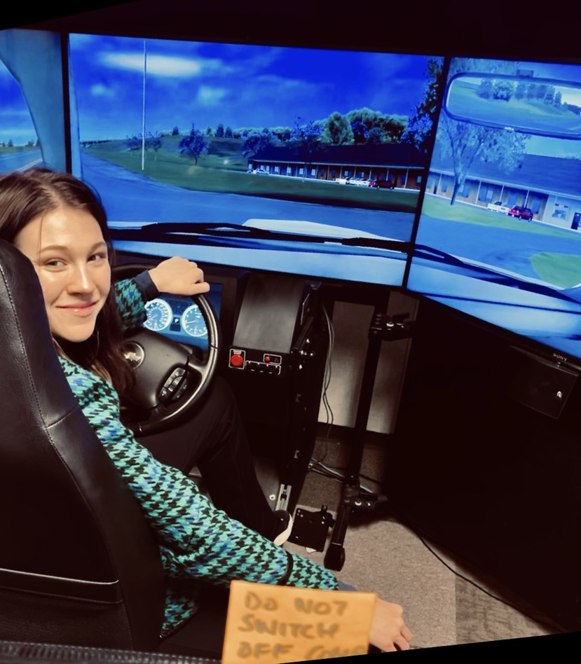
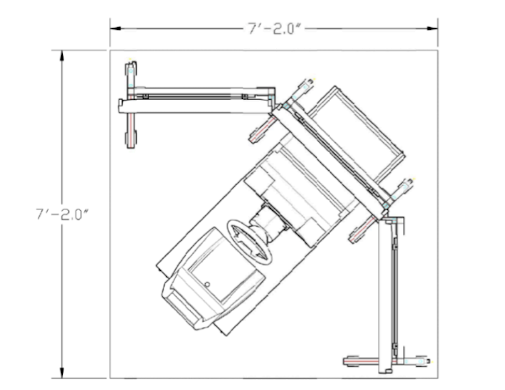
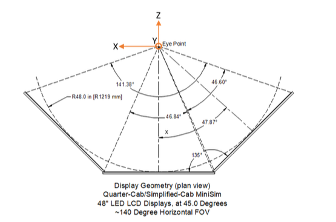
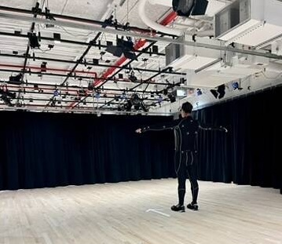

### Driving simulators

#### Fixed-based driving simulator

- [NADS miniSim](https://www.nads-sc.uiowa.edu/minisim/) driving simulator (Quarter Cab) is a *fixed-based* simulator for conducting human subjects experiments on driving behavior. 

:::row
::: {.col-md-4 .img-container}
{.img-fluid .rounded}
:::

::: {.col-md-4 .img-container}
{.img-fluid .rounded}
:::

::: {.col-md-4 .img-container}
{.img-fluid .rounded}
:::

:::

#### Desktop driving simulator

-   [Logitech wheel and pedals](https://www.logitechg.com/en-us/products/driving/driving-force-racing-wheel.html?srsltid=AfmBOorFw4ekLJeiU6fpXofqJcdaUul6JJJECqWEXOGFBcoug-v3__W5)

#### Free-motion simulators

-   [Meta Quest Pro](https://www.meta.com/quest/quest-pro/)
-   [Meta Quest 3](https://www.meta.com/quest/quest-3/)

### Motion Capture 

```{=html}
<div class="container">
  <div class="row align-items-center">
    <div class="col-md-7">
      <p>
        <a href="https://optitrack.com/">OptiTrack</a> camera systems are an <em>outside in</em> tracking system that have the fidelity to capture all types of human body and rigid body movements, including both subtle and fast motions. Rigid body movement can be captured when at least three markers are visible. Facial movement and skeletons can be tracked as long as a sufficient number of markers are visible.
      </p>
    </div>
    <div class="col-md-5">
      
    </div>
  </div>
</div>
```

- [Sony Mocopi](https://www.sony.net/Products/mocopi-dev/en/documents/Home/Aboutmocopi.html#:~:text=Main%20Features,waist%2C%20hands%2C%20and%20legs.) are an *inside out* tracking system that estimates the position and posture of every joint in the body using data from six sensors attached to the head, waist, hands, and legs.

### Eye and Head Tracking

- Pupil Labs eye-tracking equipment


