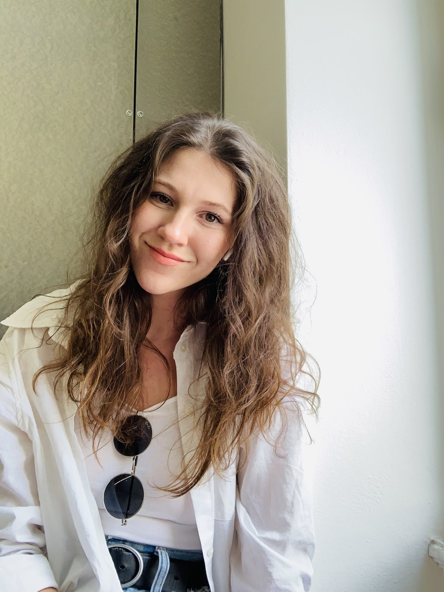

```{=html}
<div class="main-wrapper">
  <div class="content-wrapper">
    <!-- Typing Animation Section -->
    <div class="typing-container">
      <h1 class="typing-text">
        <span class="greeting">g r a c e</span>
        <span class="name">d o u g l a s</span>
      </h1>
    </div>

    <!-- Main Two Column Layout -->
    <div class="two-column-layout">
      <!-- Left Column: Content -->
      <div class="content-column">
        <div class="intro-box">
          Hey! grace-io here. As a human-subjects researcher, I focus on developing human-like models that capture how road users behave in shared urban spaces. My dissertation work specifically explores how different cultures represent vulnerable road users in mixed-traffic environments. The goal is to create computational models that are <em>fair</em>, <em>safe</em>, and <em>robust</em> representations of real-time negotiations between motorized and nonmotorized road users, ultimately supporting the development of more equitable and inclusive transportation infrastructure, connected technologies, and automated systems in these complex urban environments.
        </div>

        <p>Currently I'm a Transportation Systems Ph.D. Candidate at the <a href="https://c2smarter.engineering.nyu.edu/">C2SMART Institute</a> in the Civil & Urban Engineering Department at the New York University Tandon School of Engineering in Downtown Brooklyn, NY. My advisor is <a href="https://engineering.nyu.edu/faculty/linda-ng-boyle">Dr. Linda Ng Boyle</a> at C2SMART's HumanFUEL (Human Factors and Urban Ergonomics Lab), where we develop user-centered road safety solutions for a dynamic set of motorized and nonmotorized agents. Some current project work I am involved with:</p>

        <p><strong>Unregulated pedestrian behavior in mixed-traffic driving environments</strong>. Locale-specific feature learning is necessary training to ensure safe deployment around vulnerable road users. This project is jointly conducted at NYU and THI (Germany) to examine inter-cultural differences of pedestrian adherence to road regulation.</p>

        <ul>
          <li>How does vulnerable road user (VRU) behavior change between geographically separate locales?</li>
          <li>Are separate locales identifiable by their VRU behavior?</li>
          <li>How can locale-specific models of VRU behavior contribute to our current representations of mixed-traffic driving environments?</li>
        </ul>

        <p><strong>Pedestrian exposure for crash prediction.</strong> Prediction models are only as good as the data they learn from. This study uses a previously developed pedestrian exposure to environmental risk measure to track microenvironment pedestrian path-planning and likelihood of vehicle crash incidence at the intersection-level of analysis.</p>

        <ul>
          <li>How does the inclusion of pedestrian activity in the microenvironment improve the performance of intersection-level crash rate prediction?</li>
          <li>How do we develop a framework for identifying, analyzing, and learning from prediction model misclassifications?</li>
        </ul>

        <h3>☕️ <em>Water cooler coffee?</em><sup>[1,2]</sup></h3>
        <p>I'm best over a cup of joe :) Please reach out with any questions or to discuss my work!</p>

        <div class="keywords">
          Keywords: human factors, road safety, naturalistic driving environments, road user behavior, statistical modeling, human subjects research, simulation, mixed-traffic driving environments
        </div>

        <div class="footnotes">
          Koch, T., & Denner, N. (2022). Informal communication in organizations: work time wasted at the water-cooler or crucial exchange among co-workers?. Corporate Communications: An International Journal, 27(3), 494-508.
          Woo, D., Endacott, C. G., & Myers, K. K. (2023). Navigating water cooler talks without the water cooler: Uncertainty and information seeking during remote socialization. Management Communication Quarterly, 37(2), 251-280.
        </div>
      </div>

      <!-- Right Column: Images -->
      <div class="image-column">
        <div class="sticky-images">
          <figure class="image-item">
            <figcaption class="image-caption">AFK grace...</figcaption>
            
          </figure>
          <figure class="image-item">
            <figcaption class="image-caption">is learning to boulder,</figcaption>
            
          </figure>
          <figure class="image-item">
            <figcaption class="image-caption">but cannot wait for shavasana.</figcaption>
            
          </figure>
        </div>
      </div>
    </div>
  </div>
</div>
```
