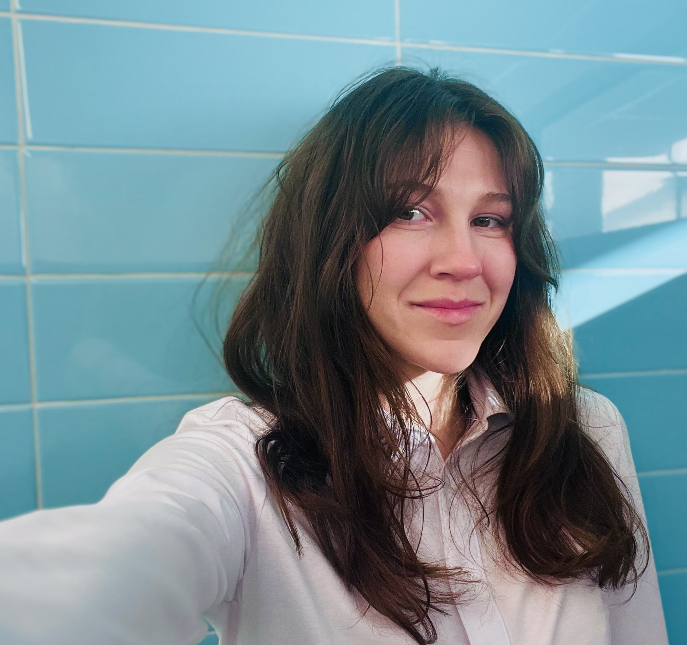
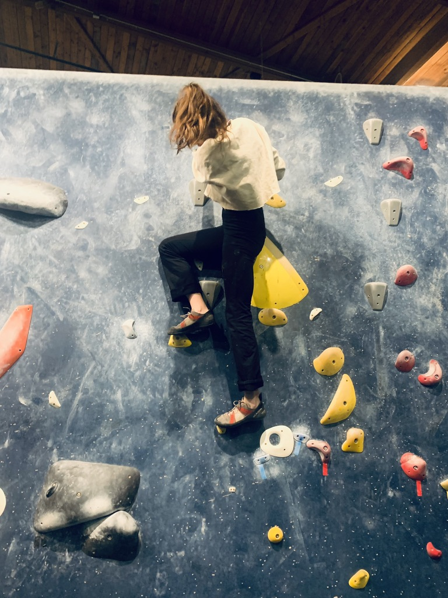
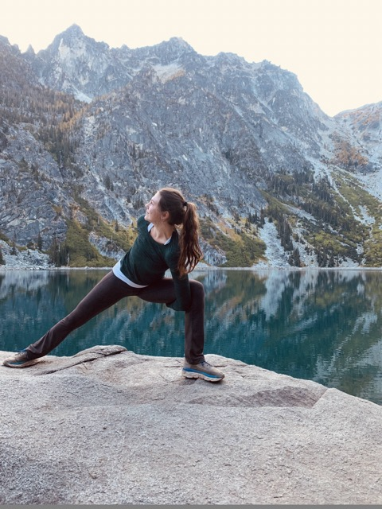

```{=html}
<div class="main-wrapper">
  <div class="content-wrapper">
    <!-- Header Section -->
    <div class="typing-container">
      <h1 class="typing-text">
        <span class="greeting">g r a c e</span>
        <span class="name">d o u g l a s</span>
      </h1>
    </div>

    <!-- Main Two Column Layout -->
    <div class="two-column-layout">
      <!-- Left Column: Content -->
      <div class="content-column">
        <div class="intro-box">
          <div class="intro-box-title">
            👋  WELCOME IN
          </div>
          <div class="intro-box-content" style="--n:606;">
            My research explores the role of the built environment as a platform for safe and equitable road user negotiations in shared road space. To do this I build simulations on a variety of free-motion and fixed-base platforms to capture locale-specific context between motorized and nonmotorized agents. The goal is to develop <span class="italic">fair</span>, <span class="italic">safe</span>, and <span class="italic">scalable</span> representations of these real-time negotiations in shared urban spaces. This work can inform the design of more inclusive transportation infrastructure, connected technologies, and automated systems in complex urban environments.
          </div>
        </div>
        
        <div class="keywords">
Keywords: human factors, road safety, naturalistic driving environments, road user behavior, statistical modeling, human-computer interaction, human-subjects research, simulation, mixed-traffic driving environments
        </div>

        <p>Currently I'm a Transportation Systems Ph.D. Candidate at the <a href="https://c2smarter.engineering.nyu.edu/">C2SMART Institute</a> in the Civil & Urban Engineering Department at the New York University Tandon School of Engineering in Downtown Brooklyn, NY. My advisor is <a href="https://engineering.nyu.edu/faculty/linda-ng-boyle">Dr. Linda Ng Boyle</a> at C2SMART's HumanFUEL (<a href="https://wp.nyu.edu/tandonschoolofengineering-humanfuel/">Human Factors and Urban Ergonomics Lab</a>), where we develop user-centered road safety solutions using statistical modeling and human-subjects experimentation.</p>

        <div class="recruitment-flyer">
          <div class="recruitment-tag">now recruiting</div>
          <h3><em>Eyes Up!</em> &mdash; paid walking study in NYC</h3>
          <p>Wear eye-tracking glasses on two short walks (~0.5&nbsp;mi each) through a neighborhood you already know, and think aloud as you go. Two sessions across three days, $30 compensation. Adults 18&ndash;65 who regularly walk their area.</p>
          <a href="https://docs.google.com/forms/d/e/1FAIpQLSet-XjfG9CZ6ECmrmsxIMPx5PgeQJKgTvcCgjdiL8_6G3gENA/viewform"
             class="button-link centered"
             target="_blank" rel="noopener">
             Participant interest form &rarr;
          </a>
        </div>
      </div>

      <!-- Right Column: Images -->
      <div class="image-column">
        <div class="sticky-images">
          <figure class="image-item circle">
            
            <figcaption class="image-caption">AFK grace...</figcaption>
          </figure>
          <figure class="image-item">
            
            <figcaption class="image-caption">is learning to boulder,</figcaption>
          </figure>
          <figure class="image-item">
            
            <figcaption class="image-caption">but cannot wait for shavasana.</figcaption>
          </figure>
        </div>
        
        <!-- Water Cooler Coffee Section -->
        <div style="margin-top: 40px;">
          <h3 id="coffee">☕️ <em>Water cooler coffee?</em><sup>1,2</sup></h3>
          <p>I'm best over a cup of joe :) Please reach out with any questions or to discuss my work! You can email me at <a href="mailto:grace.douglas@nyu.edu">grace.douglas@nyu.edu</a> or connect with me on <a href="https://www.linkedin.com/in/grace-douglas-a92a44132/">LinkedIn</a>.</p>
        </div>
      </div>
    </div>

    <!-- Full Width Footnotes -->
    <div class="footnotes">
      <p><sup>1</sup>Koch, T., & Denner, N. (2022). Informal communication in organizations: work time wasted at the water-cooler or crucial exchange among co-workers?. Corporate Communications: An International Journal, 27(3), 494-508.</p>
      <p><sup>2</sup>Woo, D., Endacott, C. G., & Myers, K. K. (2023). Navigating water cooler talks without the water cooler: Uncertainty and information seeking during remote socialization. Management Communication Quarterly, 37(2), 251-280.</p>
    </div>
  </div>
</div>
```
