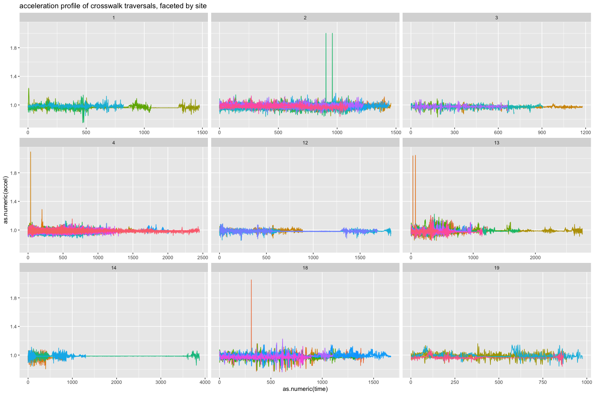
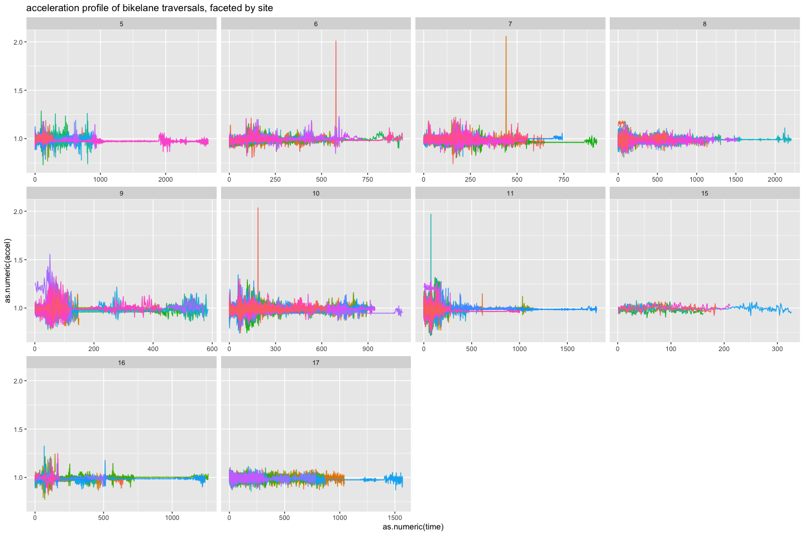
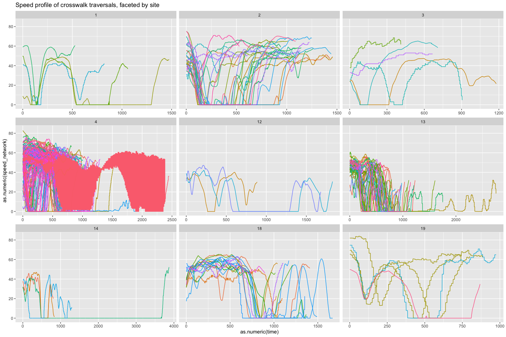
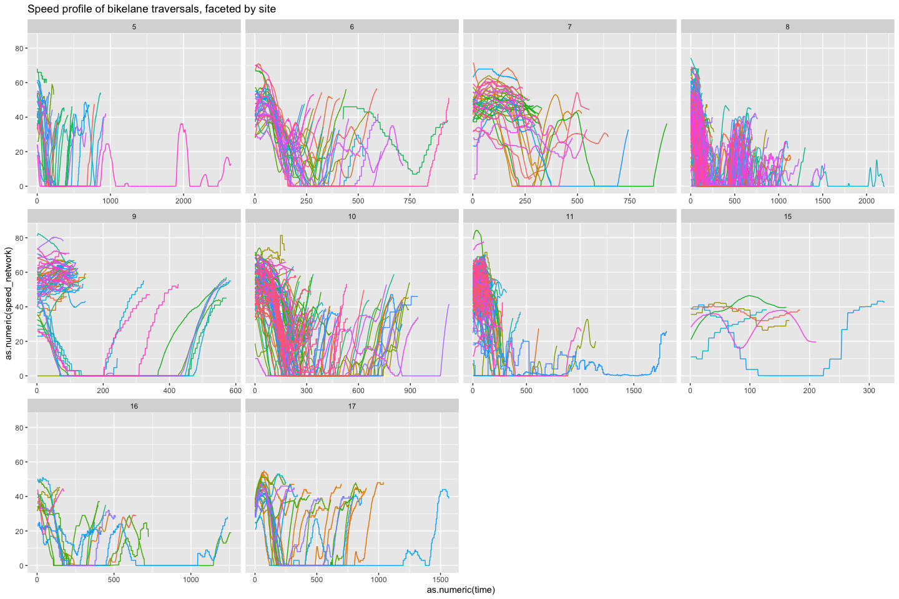

## Statistical Modeling Techniques

- Dynamic Bayesian networks

::: row
::: {.col-md-4 .img-container}
{.img-fluid .rounded}
:::

::: {.col-md-4 .img-container}
{.img-fluid .rounded}
:::
:::

:::row
::: {.col-md-4 .img-container}
{.img-fluid .rounded}
:::

::: {.col-md-4 .img-container}
{.img-fluid .rounded}
:::
:::

- Zero-inflated count models
- Crash severity modeling
- Pedestrian exposure modeling

## Data Sources

- SHRP2 NDS (Strategic Highway Research Program 2 Naturalistic Driving Study)
- Survey of Health, Aging and Retirement in Europe (SHARE)
- GPS and accelerometer data for pedestrian movement

## Analysis Tools

- R: Statistical analysis and modeling
- Python: Data preprocessing and machine learning
- MATLAB: Computational analysis

## Current Projects

- Analyzing the impact of environmental features on pedestrian crash likelihood
- Investigating the relationship between virtual meeting engagement and takeover performance in automated vehicles

