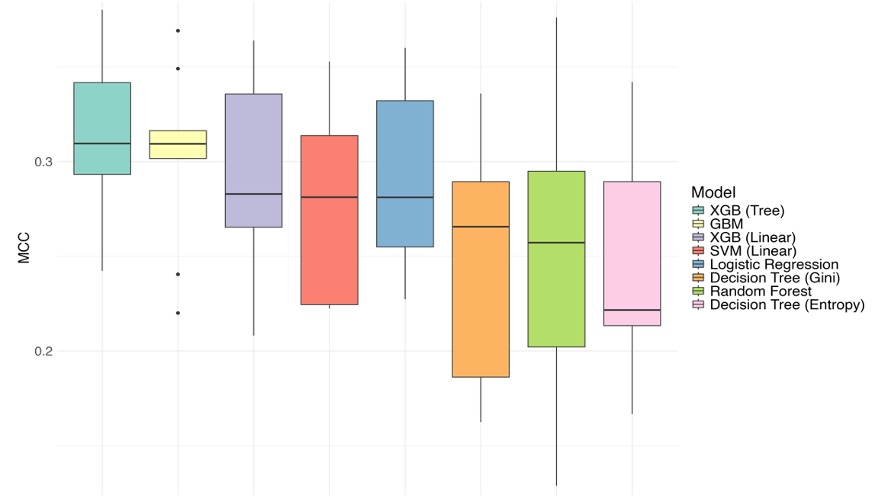
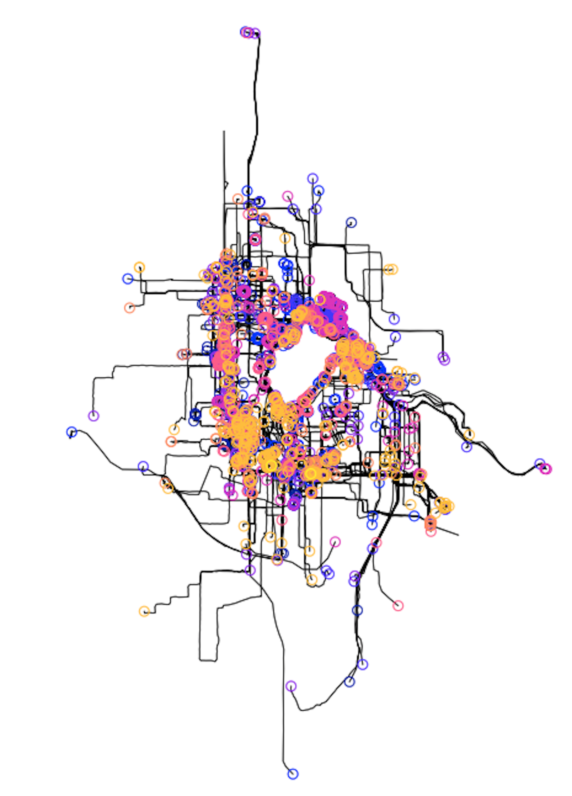
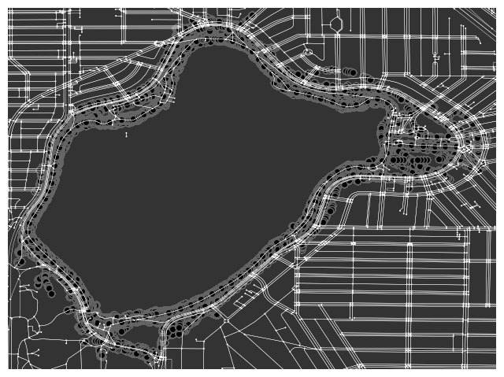
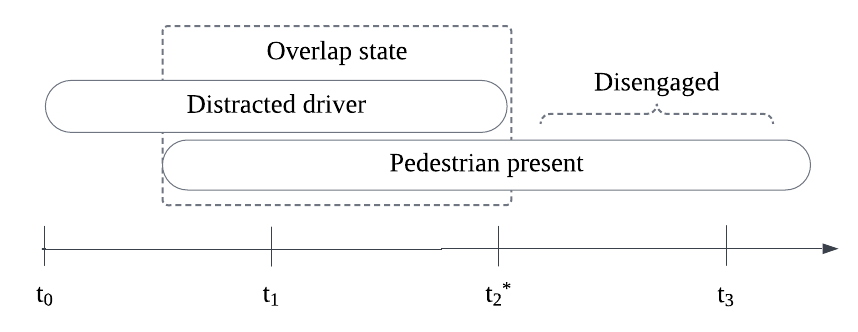
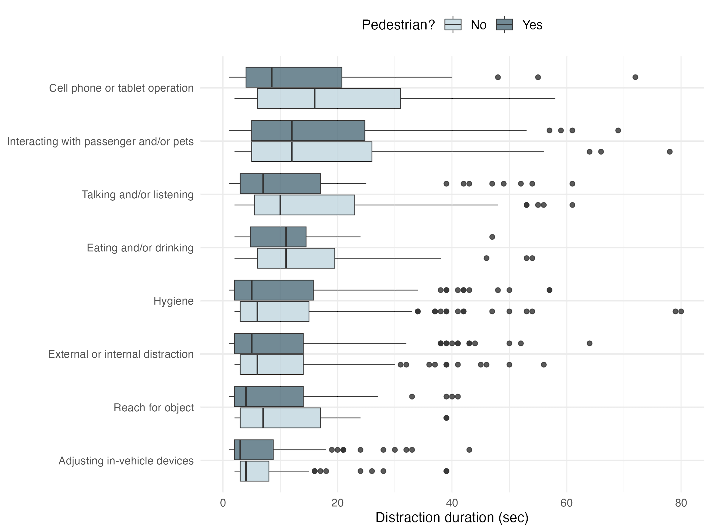
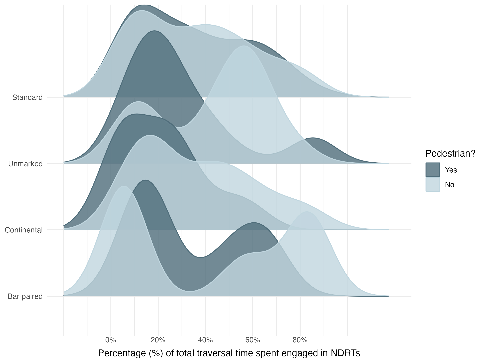
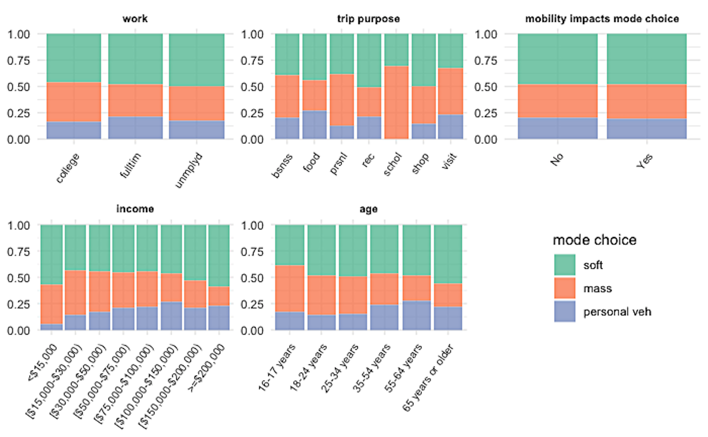
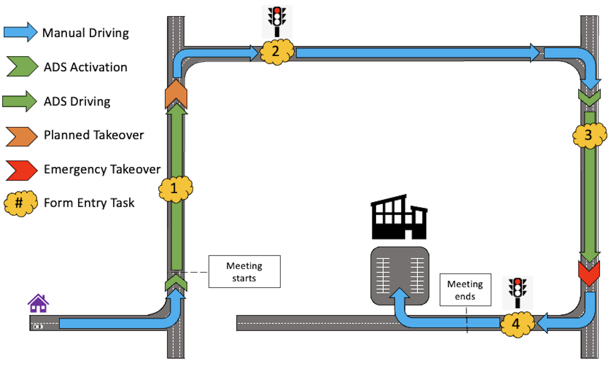
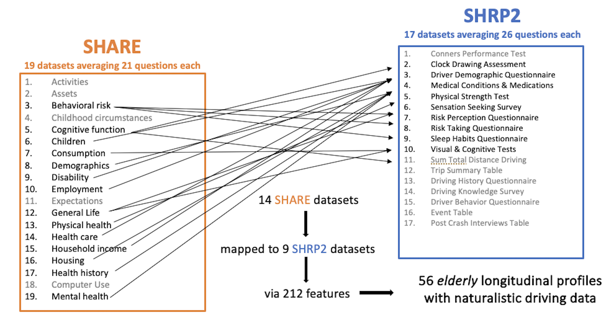
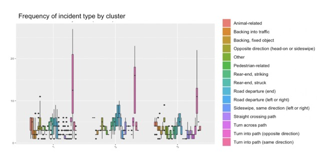

```{=html}
<div class="main-wrapper">
  <div class="content-wrapper">
    <div class="intro-box">
     <div class="intro-box-title">
       <span class="emoji">⏩</span>TLDR;
     </div>
     <div class="intro-box-content" style="--n:260;">My work is a mix of obervational and experimental methods. Traffic safety and road user behavior are underlying themes throughout my research, paired with an underlying question: <span class="italic">How can the built environment support safe and fair mixed-traffic negotiations?</span>
     </div>
    </div>
```

```{=html}
<!-- Pedestrian Exposure Project -->
<section class="lab-section" style="padding-top: 60px;">
  <div class="two-column-layout">
    <div class="content-column">
      <section class="project-section">
        <h3 id="ped-study">
          Pedestrian Exposure for Crash Prediction
          <a href="https://github.com/grackith/tangle-town" target="_blank" class="project-github">
            <i class="fab fa-github"></i>
          </a>
        </h3>
        <p><strong>Funded by: National Highway Traffic Safety Administration (NHTSA)</strong></p>
        
        <p><strong>Abstract:</strong> Pedestrian safety in urban environments remains a critical challenge, with U.S. cities experiencing a dramatic 60% increase in pedestrian fatalities over the past decade. To address this crisis, we're developing more sophisticated crash prediction models that incorporate detailed measures of pedestrian exposure to environmental risk. Our approach focuses on tracking pedestrian path-planning behaviors within microenvironments and analyzing their relationship to vehicle crash incidents at intersections. By incorporating granular data about pedestrian activity levels and environmental factors, we aim to create more accurate predictions of collision risk. The rarity of pedestrian-vehicle crashes, while fortunate, presents a significant challenge for developing preventative measures. Our research addresses this by establishing robust geospatial estimates of pedestrian activity as a proxy measure for crash likelihood—acknowledging that areas with higher pedestrian activity naturally face increased crash potential. Through this work, we're advancing both the performance of intersection-level crash predictions and developing a systematic framework for analyzing prediction model misclassifications, ultimately contributing to the design of safer urban spaces.</p>
      </section>
    </div>
    
    <div class="image-column">
      <div class="project-gallery">
        <div class="gallery-images" id="ped-exposure-gallery">
          <figure>
            
            <figcaption class="image-caption"> </figcaption>
          </figure>
          <figure>
            
            <figcaption class="image-caption">Comparing model performance to predict intersection crash state (whether or not a pedestina-vehicle crash incident occurred during an 8-year collection period).</figcaption>
          </figure>
        </div>
        <div class="gallery-nav" id="ped-exposure-nav">
          <span class="gallery-dot"></span>
          <span class="gallery-dot"></span>
        </div>
      </div>
    </div>
  </div>
</section>
```


```{=html}
<section class="lab-section">
  <div class="two-column-layout">
    <div class="content-column">
      <section class="project-section">
        <h3 id="sim2real">
          <em>Sim2Sim</em>: Virtualized mixed-traffic driving environments with human regulated RL agents 
          <a href="https://github.com/grackith/tangle-town" target="_blank" class="project-github">
            <i class="fab fa-github"></i>
          </a>
        </h3>
          <p><strong>Abstract:</strong> Reinforcement learning methods are useful for training agency in unknown state spaces and previously unseen environments. Model-free adaptivity produces trained agents that can perform in real-world environments not exactly mimicking previous training environments. However, deploying these algorithms on-line in real-world traffic environments is still relatively nonexistant due to potential safety implications for both the in-vehicle driver and other road users (ORUs). Therefore, this project proposes a sim-to-sim transfer: previously trained human regularized RL agents (HR-PPO) are deployed into an multiplayer experimentation setting (Strangeland) to interact with driving and walking participants. This approach can validate and fine-tune RL agent training in a context-rich setting.</p>
      </section>
    </div>

    <div class="image-column">
      <div style="display: flex; flex-direction: column; gap: 30px;">
        <div class="sticky-images">
          <figure class="image-item">
            
            <figcaption class="image-caption">Driver perspective of Strangetown, an inter-urban instantiation of Strangeland to investigate informal behavior among mixed-traffic road agents. </figcaption>
          </figure>
        </div>


        <figure style="margin: 0;">
          <video 
            controls
            muted
            playsinline
            style="width: 100%; height: auto; max-height: 500px; object-fit: contain;"
          >
            <source src="videos/casting-precaptured-motion.mp4" type="video/mp4">
            Your browser does not support the video tag.
          </video>
          <figcaption class="image-caption">
            Pre-captured motion using the Optitrack system of two friends high-fiving: spawned in Strangeland.
          </figcaption>
        </figure>
      </div>
    </div>
  </div>
</section>
```


```{=html}
<!-- Unregulated Pedestrian Project -->
<section class="lab-section">
  <div class="two-column-layout">
    <div class="content-column">
      <section class="project-section">
        <h3 id="unregulated-ped">
          <em>JAYWALK</em>: Unregulated pedestrian behavior in mixed-traffic driving environments
          <a href="https://github.com/grackith/walk-in-the-park" target="_blank" class="project-github">
            <i class="fab fa-github"></i>
          </a>
        </h3>
        <p><strong>Funded by: National Science Foundation (NSF) - GermanXUS research exchange</strong></p>
        
        <p><strong>Abstract:</strong> With pedestrians constituting 23% of global road traffic fatalities in 2021, understanding cross-cultural behavioral patterns is critical for developing adaptive safety systems. Predicting pedestrian behavior remains challenging due to their dynamic movement patterns and variable adherence to traffic regulations.In addition, the development of autonomous vehicle systems face significant limitations in replicating human communication protocols that typically resolve ambiguous traffic situations. This is evidenced by incident data showing autonomous vehicle accidents predominantly occur during automated operation involving unexpected pedestrian actions. Through systematic analysis of pedestrian behavior at signalized intersections, this research aims to inform both the development of culturally-adaptive autonomous systems and the implementation of more effective urban infrastructure across diverse societal contexts.</p>

        <!-- Moved image here, under the text -->
        <figure style="margin-top: 30px;">
          
          <figcaption class = "image-caption">
            Generative Adversarial Imitation Learning (GAIL) of pedestrian path-planning in informal urban environments.
          </figcaption>
        </figure>
      </section>
    </div>
    
    <div class="image-column">
      <!-- Gallery for remaining images -->
      <div class="project-gallery">
        <div class="gallery-images" id="unreg-ped-gallery" style="width: 100%; display: flex; overflow: hidden;">
          <figure style="flex: 0 0 100%; min-width: 100%; display: none; margin: 0; transition: opacity 0.3s ease;">
            
            <figcaption class = "image-caption">
              Graph-based RL environment for pedestrian preference learning at Greenlake, Seattle, WA.
            </figcaption>
          </figure>
          <figure style="flex: 0 0 100%; min-width: 100%; display: none; margin: 0; transition: opacity 0.3s ease;">
            
            <figcaption class = "image-caption">
              Weighting a step-size within a graph-based state space with historical collections of pedestrian walking activity.
            </figcaption>
          </figure>
        </div>
          <div class="gallery-nav" id="unreg-ped-nav">
            <span class="gallery-dot"></span>
            <span class="gallery-dot"></span>
          </div>
        </div>
      </div>
    </div>
  </div>
</section>
```


```{=html}
<!-- Multimodal Environments Project -->
<section class="lab-section">
  <div class="two-column-layout">
    <div class="content-column">
      <section class="project-section">
        <h3 id="multimodal-envs">
          Multimodal Environments & Multitasking Driving Behaviors
          <a href="https://github.com/grackith/NRDT-engagement--mixed-traffic-settings" target="_blank" class="project-github">
            <i class="fab fa-github"></i>
          </a>
        </h3>
        <p><strong>Funded by: Federal Highway Administration (FHWA)</strong></p>

        <p><strong>Abstract</strong>: With over 42,000 roadway fatalities in 2022 and research showing that drivers spend roughly 50% of their time engaged in non-driving tasks, understanding driver behavior in complex environments is crucial. Our project leverages the largest naturalistic driving study to date (SHRP2 NDS) to examine how drivers multitask in multimodal urban environments. By analyzing 19 urban locations with pedestrian and cyclist infrastructure, we investigate driver engagement in secondary tasks while interacting with vulnerable road users.
Our analysis integrates three key data sources: video recordings of driver behavior and urban environments, vehicle kinematics (speed, acceleration), and anonymized demographic information. Using mixed-effect binary logistic regression and Bayesian network models, we identified significant patterns in driver behavior around crosswalks and bike treatments. The Bayesian networks, particularly valuable for modeling complex systems with uncertain relationships, reveal conditional dependencies between variables that could inform both infrastructure design and Advanced Driver Assist System (ADAS) development to enhance road safety for all users.</p>
      </section>
    </div>
    
    <div class="image-column">
      <div class="project-gallery">
        <div class="gallery-images" id="multimodal-gallery">
          <figure>
            
            <figcaption class="image-caption">Two operational measures are developed to describe driver NDRT engagement in the presence of vulnerable road users (VRUs): 1. an *overlap state*, and 2. a *disengagement point*.</figcaption>
          </figure>
          <figure>
            
            <figcaption class="image-caption">Average duration of nondriving-related task (NDRT) engagement across 1,000+ driving traversals.</figcaption>
          </figure>
          <figure>
            
            <figcaption class="image-caption">Average proportion of driving traversal driver spent engaged in NDRTs. The bimodal distribution across VRU facilities suggest two driver distraction profiles: isolated engagement and serial engagement. The longest serial engagement observed spanned was 78% of the driver's trip.</figcaption>
          </figure>
        </div>
        <div class="gallery-nav" id="multimodal-nav">
          <span class="gallery-dot"></span>
          <span class="gallery-dot"></span>
          <span class="gallery-dot"></span>
        </div>
      </div>
    </div>
  </div>
</section>
```


```{=html}
<!-- Mode Choice Project -->
<section class="lab-section">
  <div class="two-column-layout">
    <div class="content-column">
      <section class="project-section">
        <h3 id="mode-choice">
          The Mode Choice Should be my Choice!
          <a href="https://github.com/grackith/sip-mode-flow" target="_blank" class="project-github">
            <i class="fab fa-github"></i>
          </a>
        </h3>
        <p><strong>Abstract</strong>: In response to rising VRU deaths in dense urban settings, and increased support for complete street designs, this project examines the relationship between mode choice and the surrounding built environment. This projects uses New York City as a living lab: mode choice data and trip purpose are from the <a href="https://www.nymtc.org/en-us/Data-and-Modeling/Travel-Surveys/Regional-Establishment-Survey">Regional Establishment Survey (RES)</a>, and GIS-linked built environment features (i.e, high-visibility crosswalks, average roadway width, slow-speed zone) are provided by the <a href="https://opendata.cityofnewyork.us/">NYC Open Data Portal</a>. A mixed logit model is developed to compare individual heterogeneity in soft, mass, and personal (vehicle) mode choices with local built environment support for observed choices. Sociodemographics such as age, income, and mobility status are also considered. An alternative-specific travel time variable is considered, and a more thorough discussion of mode choice elasticity to changes in the local microenvironment is provided.</p>
      </section>
    </div>
    
    <div class="image-column">
      <div class="project-gallery">
        <div class="gallery-images" id="mode-choice-gallery">
          <figure>
            
            <figcaption class="image-caption">NYC Open Data Portal tracks Vision Zero's <em>Street Improvement Projects</em>, which are safety and well-being solutions in historically risky urban areas. Some treatments: curb extensions (red circle), slow-speed zones (pink areas), enhanced crossings (purple circle), improved green space (green areas).</figcaption>
          </figure>
          <figure>
            
            <figcaption class="image-caption">Demographic profiles reveal mode choice differences among income, age and trip purpose.</figcaption>
          </figure>
        </div>
        <div class="gallery-nav" id="mode-choice-nav">
          <span class="gallery-dot"></span>
          <span class="gallery-dot"></span>
        </div>
      </div>
    </div>
  </div>
</section>
```

```{=html}
<!-- Mobile Office Project -->
<section class="lab-section">
  <div class="two-column-layout">
    <div class="content-column">
      <section class="project-section">
        <h3 id="mobile-office">
          The Next Mobile Office: How will we Work in Self-Driving Cars?
          <a href="https://github.com/grackith?tab=repositories" target="_blank" class="project-github">
            <i class="fab fa-github"></i>
          </a>
        </h3>
        <p><strong>Funded by: National Science Foundation (NSF)</strong></p>
        <p><strong>Abstract</strong>: This research project explores the intersection of Advanced Driver Assistance Systems (ADAS) and mobile work environments. Participants are asked to manually control the vehicle in a simulated two-lane rural road environment, and then engage a Level 3 ADAS and join a pre-recorded virtual meeting discussing and revising presentation slides. The participant is queued engaging questions about the meeting task, but are presented with a take-over scenario (participant must regain control of the vehcile). The research aims to understand how meeting participation and engagement impact a driver's takeover timing in autonomous vehicles, while also examining the reciprocal effects of takeover scenarios on meeting performance, with participants completing a pre- and post-drive survey to capture their overall trust in the automation. This study utilizes the NADS miniSim vehicle simulator to create a controlled environment for investigating the complex dynamics between virtual work engagement and autonomous system safety protocols.</p>
      </section>
    </div>
    
    <div class="image-column">
      <div class="project-gallery">
        <div class="gallery-images" id="mobile-office-gallery">
          <figure>
            
            <figcaption class="image-caption">Researchers pre-record a virtual work meeting to select a slide deck.</figcaption>
          </figure>
          <figure>
            
            <figcaption class="image-caption">A level 3 Automated Driving System (ADS) can conditionally take full control over the dynamic driving task. Participants are asked to begin the drive in manual operation, then join engage their ADS and join virtual meeting at their convenience.</figcaption>
          </figure>
        </div>
        <div class="gallery-nav" id="mobile-office-nav">
          <span class="gallery-dot"></span>
          <span class="gallery-dot"></span>
        </div>
      </div>
    </div>
  </div>
</section>
```

```{=html}
<!-- Cross-Cultural Mapping Project -->
<section class="lab-section">
  <div class="two-column-layout">
    <div class="content-column">
      <section class="project-section">
        <h3 id="profile-mapping">
          Cross-cultural mapping of older drivers
          <a href="https://github.com/grackith?tab=repositories" target="_blank" class="project-github">
            <i class="fab fa-github"></i>
          </a>
        </h3>
        <p><strong>Funded by: National Science Foundation (NSF)</strong></p>
        <p><strong>Abstract</strong>: Older drivers face unique challenges that can contribute to age-related accidents, prompting our research into developing sociodemographic profiles to enhance in-vehicle support systems. Building comprehensive naturalistic driving databases is both time-intensive and costly, which led us to explore an innovative approach: mapping driving profiles across different databases that share similar sociodemographic features but represent distinct populations. By bridging the <a href="https://insight.shrp2nds.us/">Strategic Highway Research Program (SHRP2) naturalistic driving database</a> with the <a href="https://share-eric.eu/">Survey of Health, Aging, and Retirement in Europe (SHARE)</a>, we identify personal characteristics that allow us to examine how the choice to continue driving becomes a deeply contextual decision, shaped by one's cultural and geographic environment.</p>
      </section>
    </div>
    
    <div class="image-column">
      <div class="project-gallery">
        <div class="gallery-images" id="cross-cultural-gallery">
        <figure>
            
            <figcaption class="image-caption"> Mapping driving profiles across sociodemographics: how do older drivers navigate their decision to continue driving?</figcaption>
          </figure>
          <figure>
            
            <figcaption class="image-caption"> SHARE-SHRP2 mapping. Preliminary findings: Cluster 1: higher rates of other road user involved incidents. Cluster 2: highest rates of turning incidents. Cluster 3: highest rates of 'near-crashes'.</figcaption>
          </figure>
        </div>
        <div class="gallery-nav" id="cross-cultural-nav">
          <span class="gallery-dot"></span>
          <span class="gallery-dot"></span>
        </div>
      </div>
    </div>
  </div>
</section>
```

```{=html}
<!-- Pedestrian Exposure Devices Project -->
<section class="lab-section">
  <div class="two-column-layout">
    <div class="content-column">
      <section class="project-section">
        <h3 id="pedX">
          Measuring Pedestrian Exposure Using Electronic Devices
          <a href="https://github.com/grackith/dc-autoui2024" target="_blank" class="project-github">
            <i class="fab fa-github"></i>
          </a>
        </h3>
        <p><strong>Funded by: National Highway Traffic Safety Administration (NHTSA)</strong></p>
        <p><strong>Abstract</strong>: Crashes involving pedestrians continue to be a serious problem in the United States and represent 15% of all traffic collisions. Pedestrians are among the most vulnerable road users. In 2020, pedestrians accounted for 6,516 fatalities and an estimated 54,769 injuries in motor vehicle crashes. Over the last decade, the U.S. has seen a 46% increase in pedestrian fatalities, now representing 17% of all motor vehicle related crash fatalities (NHTSA, 2022). In response to the increased number of fatalities and the increased emphasis on vulnerable road modes (walking, cycling) as healthy transportation options, many localities are looking for ways to make walking safer. One of the challenges to developing and implementing effective pedestrian safety countermeasures is establishing a consistent and reliable estimate of the number of pedestrians at risk in a given <em>spatiotemporal slice</em>. This project operationalizes a pedestrian exposure measure from personal electronic device data (GSP, accelerometer) collected at a weeks time from over 700 participants throughout a 4-year period.</p>
      </section>
    </div>
    
    <div class="image-column">
      <div class="project-gallery">
        <div class="gallery-images" id="ped-devices-gallery">
          <figure>
            
            <figcaption class="image-caption"> Walking activity patterns in Seattle, WA from two NIH studies about health and wellness in urban infrastructure.</figcaption>
          </figure>
          <figure>
            
            <figcaption class="image-caption">Environmental buffer analysis to define levels of risk in micro-, meso-, and macro- pedestrian environments.</figcaption>
          </figure>
        </div>
        <div class="gallery-nav" id="ped-devices-nav">
          <span class="gallery-dot"></span>
          <span class="gallery-dot"></span>
        </div>
      </div>
    </div>
  </div>
</section>
</div>
</div>
```

```{=html}
<script type="text/javascript">
document.addEventListener('DOMContentLoaded', () => {
  // Animation initialization
  if (!sessionStorage.getItem('animationPlayed')) {
    const introBox = document.querySelector('.intro-box');
    introBox.classList.add('animate');
    sessionStorage.setItem('animationPlayed', 'true');
  }

  // Image Gallery class
  class ImageGallery {
    constructor(container) {
      // Your existing ImageGallery code
      this.gallery = container;
      this.figures = this.gallery.querySelectorAll('figure');
      this.nav = this.gallery.nextElementSibling;
      this.dots = this.nav.querySelectorAll('.gallery-dot');
      this.currentIndex = 0;
      
      this.showImage(0);
      this.setupEventListeners();
    }
    
    // Rest of your ImageGallery class methods
    showImage(index) {
      if (index < 0 || index >= this.figures.length) return;
      
      this.figures.forEach(fig => {
        fig.style.display = 'none';
        fig.classList.remove('active');
      });
      
      this.figures[index].style.display = 'block';
      this.figures[index].classList.add('active');
      
      this.dots.forEach(dot => dot.classList.remove('active'));
      if (this.dots[index]) {
        this.dots[index].classList.add('active');
      }
      
      this.currentIndex = index;
    }
    
    setupEventListeners() {
      this.dots.forEach((dot, index) => {
        dot.addEventListener('click', () => this.showImage(index));
      });
      
      let touchStartX = 0;
      let touchEndX = 0;
      
      this.gallery.addEventListener('touchstart', (e) => {
        touchStartX = e.touches[0].clientX;
      }, { passive: true });
      
      this.gallery.addEventListener('touchend', (e) => {
        touchEndX = e.changedTouches[0].clientX;
        const swipeDistance = touchStartX - touchEndX;
        const swipeThreshold = 50;
        
        if (Math.abs(swipeDistance) > swipeThreshold) {
          if (swipeDistance > 0 && this.currentIndex < this.figures.length - 1) {
            this.showImage(this.currentIndex + 1);
          } else if (swipeDistance < 0 && this.currentIndex > 0) {
            this.showImage(this.currentIndex - 1);
          }
        }
      }, { passive: true });
    }
  }

  // Initialize galleries
  const galleries = document.querySelectorAll('.gallery-images');
  galleries.forEach(gallery => {
    new ImageGallery(gallery);
  });
});
</script>
```
