### Current Projects

#### Pedestrian Exposure for Crash Prediction

**Funded by: National Highway Traffic Safety Administration (NHTSA)**

__Abstract__: Urban areas in the US are estimated to have faced a 60% increase in pedestrian fatalities over the past decade (GHSA, 2023). However, because these events are inherently rare, it is difficult to develop preventative measures to mitigate collision risk. An important pit stop on the road to safer streets is therefore developing robust geospatial estimates of current pedestrian activity levels. Robust estimates of pedestrian activity serve as a proxy measure for crash likelihood, as locations containing high pedestrian activity levels are naturally prone to higher pedestrian-vehicle crash rates. This project aims to predict pedestrian-vehicle collision risk based on pedestrian exposure and environmental factors at intersections. 

::: row
::: {.col-md-6 .img-container}
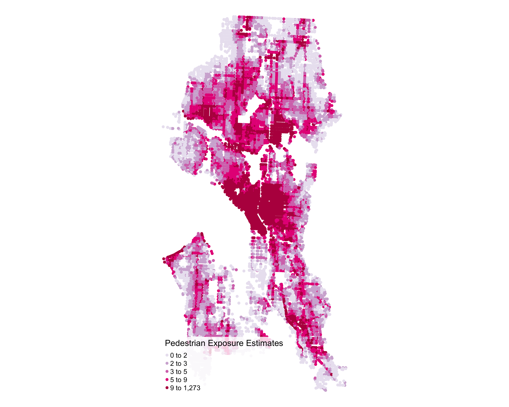{.img-fluid .rounded}
:::

::: {.col-md-6 .img-container}
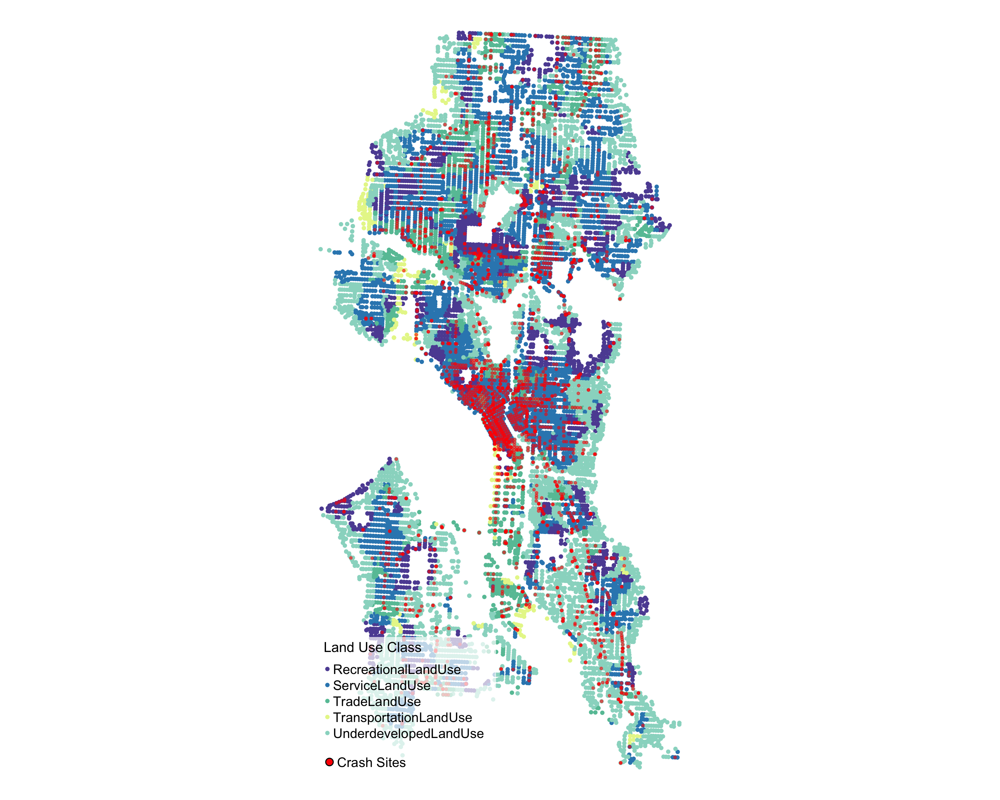{.img-fluid .rounded}
:::
:::

### Past Projects

#### Sim2Real: Virtualized mixed-traffic driving environments with human regulated RL agents

#### The Mode Choice Should be my Choice!

**Abstract**: In response to rising VRU deaths in dense urban settings, and increased support for complete street designs, this project examines the relationship between mode choice and the surrounding built environment. This projects uses New York City as a \textit{living lab}: mode choice data and trip purpose are from the Regional Establishment Survey (RES), and GIS-linked built environment features (i.e, high-visibility crosswalks, average roadway width, slow-speed zone) are provided by the \href{https://opendata.cityofnewyork.us/}{NYC Open Data Portal}. A mixed logit model is developed to compare individual heterogeneity in \textit{soft}, \textit{mass}, and \textit{personal (vehicle)} mode choices with local built environment support for observed choices. Sociodemographics such as age, income, and mobility status are also considered. An alternative-specific travel time variable is considered, and a more thorough discussion of mode choice elasticity to changes in the local microenvironment is provided.

::: row
::: {.col-md-8 .img-container}
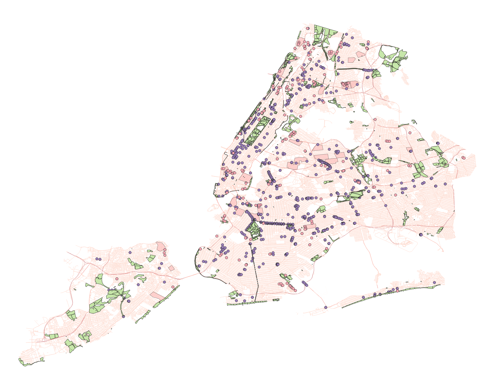{.img-fluid .rounded width="70%"}
:::

::: {.col-md-8 .img-container}
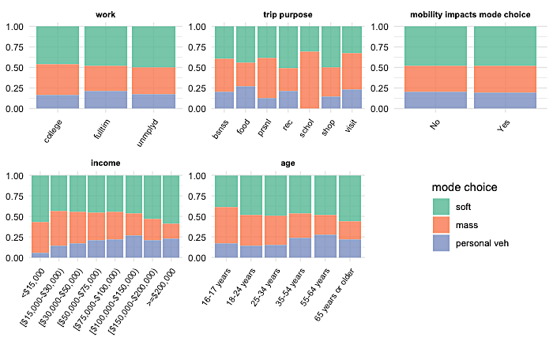{.img-fluid .rounded width="30%"}
:::
:::


#### The Next Mobile Office: How will we Work in Self-Driving Cars?

**Funded by: National Science Foundation (NSF)**

-   Investigating the impact of virtual meeting engagement on takeover performance in conditionally automated vehicles using a NADs miniSim vehicle simulator.
-   Participants are randomly assigned Emergency or Planned treatments while actively engaged in a virtual meeting.

#### Cross-Cultural Mapping of Older Drivers

**Funded by: National Science Foundation (NSF)**

**Abstract**: This research develops comprehensive profiles of older drivers to enhance support systems and reduce the likelihood of accidents. Building a database of naturalistic driving behavior is challenging and costly, making it beneficial to map profiles across databases consisting of different subpopulations. This study utilizes the Strategic Highway Research Program (SHRP2), a naturalistic driving database, and the Survey of Health, Aging, and Retirement in Europe (SHARE) database to identify personal characteristics that could be mapped between the two databases. The four types of variables mapped included medical conditions, risk-taking behavior, lifestyle, and (physiological, cognitive) function. A combination of Principle Component Analysis, Multiple Correspondence Analysis, and Factor Analysis for Mixed Data reduced the SHRP2 NDS and SHARE combined data to \hl{35} features representing the physical condition, health, lifestyle, and (physiological, cognitive) function of 60 50+ aged personal profiles. Using a Hierarchical Agglomerative Clustering approach with the mapped profiles revealed a three cluster solution with a \hl{XX} between cluster variation. Significant differences in driving behavior were identified between the three clusters, with Cluster 3 showing higher risk-taking tendencies and near miss frequencies. The research highlights the feasibility of mapping personal profiles across databases to produce multidimensional driving profiles. These insights can benefit road users, older individuals and their families, policy makers, researchers, and health and social care professionals. By utilizing the identified driver profiles, industry designers can tailor Advanced Driver Assistance Systems (ADAS)/Autonomous Driving Systems (ADS) to individual needs. Health care professionals can use the data to supplement fitness-to-drive assessments, and older individuals and their families can make informed decisions about driving support.


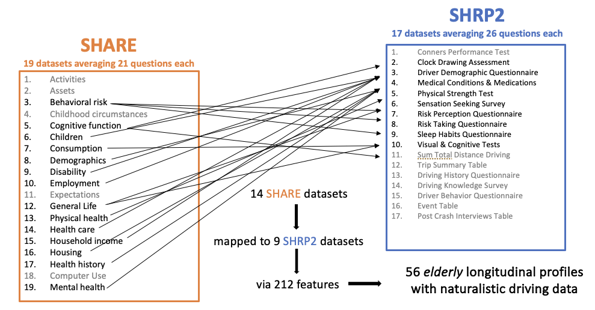{.img-fluid .rounded width="100%"}


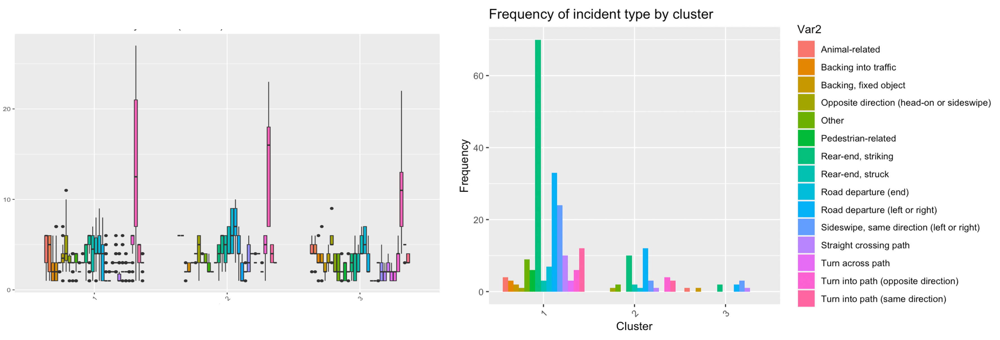{.img-fluid .rounded width="100%"}


-   Cluster 1: higher rates of other road user involved incidents
-   Cluster 2: highest rates of turning incidents
-   Cluster 3: highest rates of ’near-crashes’


#### Multimodal Environments & Multitasking Driving Behaviors

**Funded by: Federal Highway Administration (FHWA)**

**Abstract**: With more than 42,000 roadway fatalities in 2022, transportation safety researchers are interested in gathering a deeper understanding of how drivers behave, interact, and make decisions while navigating the roadway environment. Within the past decade, researchers have discovered that approximately 50 percent of a driver’s time is spent engaging in non-driving-related tasks (Dingus et al., 2016; Young et al., 2019). This project, Investigating How Multimodal Environments Affect Multitasking Driving Behaviors, approached this issue of distraction with data from the SHRP2 NDS, which is the largest naturalistic driving study to date. More specifically, the research team targeted 19 urban locations that contained pedestrian and cyclist facilities (crosswalks, bike treatments) to investigate a driver’s secondary task engagement amid other road users. Three primary groups of variables were considered in the analysis: video data to label and identify secondary task behavior and the urban environment, kinematics that describe the state (acceleration, speed, etc.) of the vehicle throughout each video file, and demographic data that were connected anonymously back to the participants in the video data. Initially, two mixed-effect binary logistic regression models were fitted to crosswalk and bike treatment data, respectively; these models were useful to confirm significant findings from the pilot study. In addition to these significant relationships, two Bayesian networks were implemented (crosswalks, bike treatments), which provided a graphical representation of the conditional dependencies between the variables considered in the analysis. Bayesian networks are useful in modeling complex systems with uncertain relationships and have been widely used in many fields, including transportation safety. The results of this study have important implications for transportation safety that could, for example, improve vulnerable road user facility design or inform future advanced driver assist system (ADAS) development. 

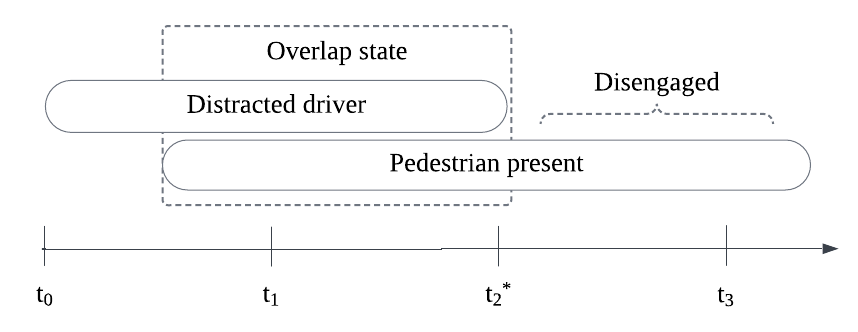{.img-fluid .rounded width="50%" height="150" style="float: center; margin: 0 50% 0 50%;"}

::: row
::: {.col-md-6 .img-container}
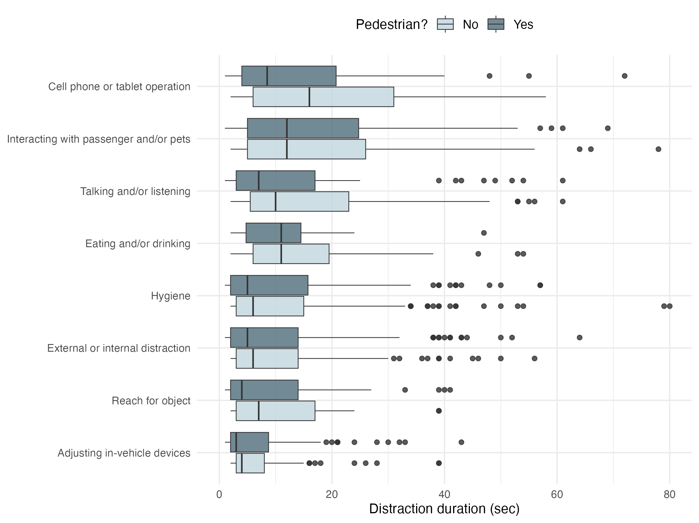{.img-fluid .rounded}
:::

::: {.col-md-6 .img-container}
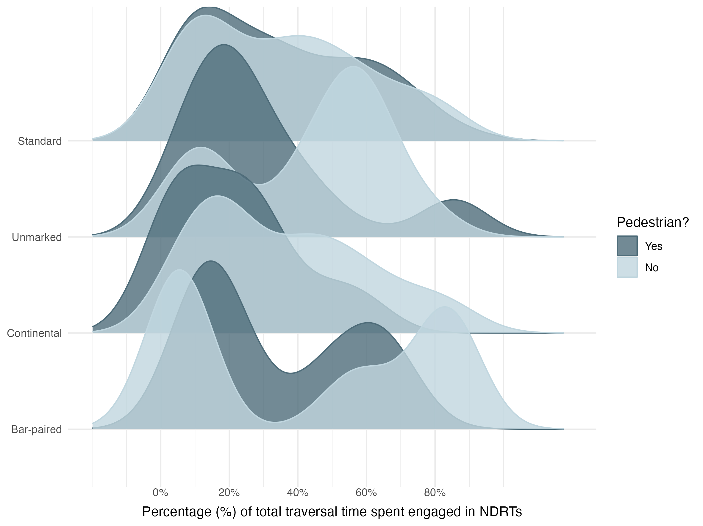{.img-fluid .rounded}
:::
:::

#### Measuring Pedestrian Exposure Using Electronic Devices

**Funded by: National Highway  Traffic Safety Administration (NHTSA)**

-   Examined pedestrian exposure and risk to collision in Seattle, WA by analyzing spatial-temporal data of pedestrian walking behavior.
-   Implemented zero-inflated count models to predict pedestrian risk dependent on environmental predictors.

```{=html}
<div class="container">
  <div class="row" style="height: 300px;"> <!-- Adjust this height as needed -->
    <div class="col-md-6 d-flex flex-column h-100">
      <div class="flex-grow-1 mb-3 overflow-hidden">
        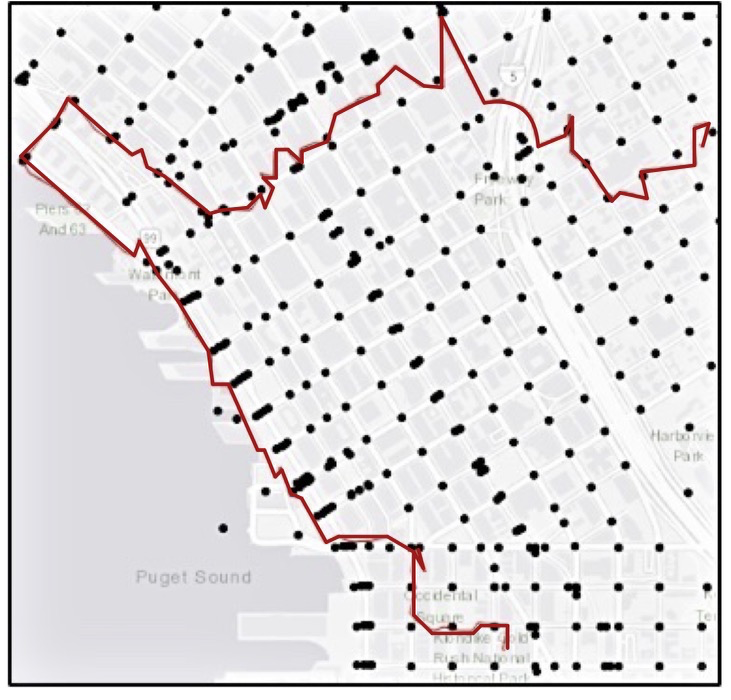
      </div>
      <div class="flex-grow-1 overflow-hidden">
        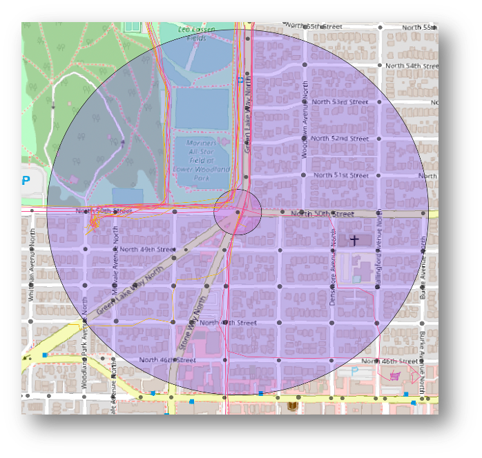
      </div>
    </div>
    <div class="col-md-6 h-100">
      <div class="h-100 overflow-hidden">
        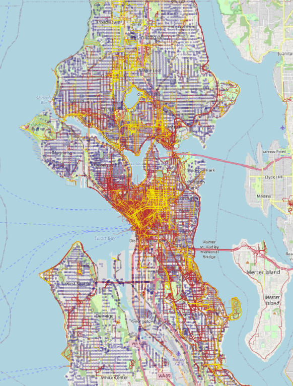
      </div>
    </div>
  </div>
</div>
```
