```{=html}
<div class="main-wrapper">
  <div class="content-wrapper">
    <div class="intro-box">
     <div class="intro-box-title">
       <span class="emoji">⏩</span>TLDR;
     </div>
     <div class="intro-box-content" style="--n:267;">My work is a mix of obervational and experimental methods. Safety in automation and road user behavior are underlying themes throughout my research, paired with an underlying question: <span class="italic">How can the built environment support safe and fair mixed-traffic negotiations?</span>
     </div>
    </div>
```


```{=html}
<!-- Current Projects Section -->
<section class="lab-section" style="padding-top: 40px; border-bottom: 2px solid #e0e0e0; padding-bottom: 40px; margin-bottom: 40px;">
  <h2 style="text-align: center; font-size: 2em; margin-bottom: 40px; color: #333;">Current Projects</h2>

  <!-- Virtual Worlds for Real Agents -->
  <div class="two-column-layout">
    <div class="content-column">
      <section class="project-section">
        <h3 id="virtual-worlds">
          Virtual Worlds for Real Agents: Validating VR Pedestrian Behavior
          <a href="https://github.com/grackith/TangleTown6" target="_blank" class="project-github">
            <i class="fab fa-github"></i>
          </a>
        </h3>
        <p><strong>Dissertation research</strong> &middot; with Cornell Tech's Interaction Research Lab</p>

        <p>VR is only a useful testbed for pedestrian research if people walk in it the way they walk outside. This study puts that assumption to the test: participants complete goal-directed (catching a bus) and exploratory (finding a bus stop) tasks in a virtual South Lake Union, Seattle, and their behavior is compared against naturalistic pedestrian traces recorded at the same physical corner.</p>

        <p>Correspondence is measured across the Hoogendoorn behavioral hierarchy &mdash; strategic (task completion), tactical (route choice), and operational (speed, trajectory) &mdash; while presence (IPQ), workload (NASA-TLX), and motion sickness (VRSQ) are tracked to keep ecological validity honest. The output is a set of validity benchmarks and calibration factors for anyone building pedestrian-aware virtual environments.</p>

        <p style="font-size: 0.9em;"><em>Presented at AutomotiveUI 2025 (Adjunct Proceedings, 73&ndash;77).</em></p>
      </section>
    </div>

    <div class="image-column">
      <div class="project-gallery has-video">
        <div class="gallery-images" id="vwra-gallery">
          <figure>
            <video muted loop playsinline controls preload="metadata">
              <source src="videos/tangletown-stabilized-clip-compressed.mp4" type="video/mp4">
              Your browser does not support the video tag.
            </video>
            <figcaption class="image-caption">VR pedestrian navigation in South Lake Union, Seattle.</figcaption>
          </figure>
          <figure>
            <video muted loop playsinline controls preload="metadata">
              <source src="videos/website-snip-rdw-lowerbodyik_compressed.mp4" type="video/mp4">
              Your browser does not support the video tag.
            </video>
            <figcaption class="image-caption">Redirected walking with lower-body IK, so a room-scale space maps onto a city block.</figcaption>
          </figure>
          <figure>
            <video muted loop playsinline controls preload="metadata">
              <source src="videos/vwra-isovist.mp4" type="video/mp4">
              Your browser does not support the video tag.
            </video>
            <figcaption class="image-caption">Per-step isovist geometry: the visible field a walker actually has, sampled along the path.</figcaption>
          </figure>
        </div>
      </div>
    </div>
  </div>

  <!-- Eyes Up! -->
  <div class="two-column-layout" style="margin-top: 50px;">
    <div class="content-column">
      <section class="project-section">
        <h3 id="eyes-up">
          <em>Eyes Up!</em> Egocentric Collections of Pedestrian Decision-Making
        </h3>
        <p><strong>Dissertation research</strong> &middot; C2SMART &middot; <a href="https://docs.google.com/forms/d/e/1FAIpQLSet-XjfG9CZ6ECmrmsxIMPx5PgeQJKgTvcCgjdiL8_6G3gENA/viewform" target="_blank" rel="noopener">now recruiting &rarr;</a></p>

        <p>One idea runs through this work: pedestrians steer their path and their attention by what they can actually see &mdash; the open, visible space around them &mdash; and risk climbs where that visibility is cut off. The VR study supported it, but VR could only track head direction, and VR is not the street.</p>

        <p>So this is the outdoor arm, with real eye tracking. New Yorkers walk two familiar routes wearing Meta Project Aria (Gen 1) glasses, which capture gaze, SLAM, IMU, and GPS at once, plus a heart-rate band and think-aloud narration into the glasses' microphone. Real-world SLAM is rebuilt into per-step isovist geometry, and the same models from the VR study are run on it &mdash; so the virtual and the real finally compare directly.</p>

        <p><strong>What it asks:</strong></p>
        <ul style="list-style-type: disc; margin-left: 20px; line-height: 1.8;">
          <li>Does gaze go toward open space, and does walking slow inside enclosed space?</li>
          <li>Does the chance of having traffic in view drop as occlusion rises?</li>
          <li>Do goal-directed and exploratory walks sample the environment differently?</li>
          <li>Do narrated moments of uncertainty cluster where the visible field fragments?</li>
        </ul>

        <p style="font-size: 0.9em;"><em>Within-subjects, ~20 participants, two ~0.5&nbsp;mi walks on routes they already know.</em></p>
      </section>
    </div>

    <div class="image-column">
      <figure style="margin: 0;">
        <video class="autoloop" muted loop playsinline controls preload="metadata"
               style="width: 100%; height: auto; max-height: 480px; object-fit: contain;">
          <source src="videos/eyesup-aria-egocentric.mp4" type="video/mp4">
          Your browser does not support the video tag.
        </video>
        <figcaption class="image-caption">
          Egocentric capture from the Aria glasses: gaze overlaid on the scene camera as a participant walks.
        </figcaption>
      </figure>
    </div>
  </div>

  <!-- So Pedestrian -->
  <div style="margin-top: 50px;">
    <section class="project-section">
      <h3 id="so-pedestrian">
        <em>So Pedestrian</em>: Detection Displays in Automated Vehicles
        <a href="https://github.com/grackith/NYU-UT-PDS" target="_blank" class="project-github">
          <i class="fab fa-github"></i>
        </a>
      </h3>
      <p><strong>Funded by: National Science Foundation (NSF)</strong> &middot; with UT&nbsp;Austin's Mobility Systems Laboratory</p>

      <p>If an automated vehicle shows you every pedestrian it sees, do you notice more &mdash; or do you stop looking? We built a Unity SAE Level 4 simulator with a 138&deg; tri-view display and five levels of detection detail (LOD0 through LOD4), then measured awareness on ambient pedestrians the display never flagged.</p>

      <p>Across 488 encounters with 27 participants, moving pedestrians were detected 90&ndash;98% of the time &mdash; but only 44% when occluded at 7&nbsp;m. Adding display detail raised trust without raising workload, and never recovered that miss. More information made passengers more confident, not more aware, which is exactly the failure mode these interfaces are supposed to prevent.</p>

      <p style="font-size: 0.9em;"><em>Accepted to AutomotiveUI 2026, Gothenburg, Sweden.</em></p>

      <figure style="margin-top: 30px; margin-bottom: 0;">
        <video controls muted playsinline preload="metadata"
               style="width: 100%; height: auto; max-height: 500px; object-fit: contain;">
          <source src="videos/lod3-2.mp4" type="video/mp4">
          Your browser does not support the video tag.
        </video>
        <figcaption class="image-caption">
          Pedestrian detection display at LOD3: position and orientation rendered for detected pedestrians.
        </figcaption>
      </figure>
    </section>
  </div>
</section>
```


```{=html}
<!-- Pedestrian Exposure Project -->
<section class="lab-section" style="padding-top: 60px;">
  <div class="two-column-layout">
    <div class="content-column">
      <section class="project-section">
        <h3 id="ped-study">
          Pedestrian Exposure for Crash Prediction
          <a href="https://github.com/grackith/tangle-town" target="_blank" class="project-github">
            <i class="fab fa-github"></i>
          </a>
        </h3>
        <p><strong>Funded by: National Highway Traffic Safety Administration (NHTSA)</strong></p>

        <p>Crash models are usually judged by how often they are right. This project asks a more useful question: when a model is wrong, is it wrong at random, or is it wrong in the same places for the same reasons?</p>

        <p>Working across 13,706 Seattle intersections, we built crash-risk models from standardized physical-activity exposure measures, then developed a misclassification framework to separate systematic model failure from random error. It concentrated 6.6% of total error into just 1.03% of locations &mdash; and street-view audits of those locations recovered three feature classes the model had omitted entirely. Systematic error, it turns out, is a map of what your data is missing.</p>

        <p style="font-size: 0.9em;"><em>Published in Accident Analysis &amp; Prevention, 235, 108633 (2026).</em></p>
      </section>
    </div>
    
    <div class="image-column">
      <div class="project-gallery">
        <div class="gallery-images" id="ped-exposure-gallery">
          <figure>
            
            <figcaption class="image-caption"> </figcaption>
          </figure>
          <figure>
            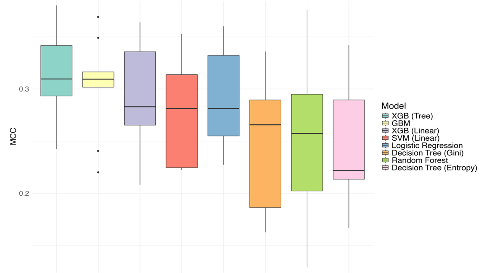
            <figcaption class="image-caption">Comparing model performance to predict intersection crash state (whether or not a pedestina-vehicle crash incident occurred during an 8-year collection period).</figcaption>
          </figure>
        </div>
      </div>
    </div>
  </div>
</section>
```


```{=html}
<section class="lab-section">
  <div class="two-column-layout">
    <div class="content-column">
      <section class="project-section">
        <h3 id="sim2real">
          <em>Sim2Sim</em>: Virtualized mixed-traffic driving environments with human regulated RL agents 
          <a href="https://github.com/grackith/tangle-town" target="_blank" class="project-github">
            <i class="fab fa-github"></i>
          </a>
        </h3>
          <p>Reinforcement learning produces agents that adapt to state spaces they were never trained on &mdash; which is exactly why nobody wants to test one on a real street. The safety cost of being wrong falls on the driver and on every other road user around them.</p>

          <p>This project proposes a sim-to-sim transfer instead. Human-regularized RL agents (HR-PPO), already trained offline, are dropped into <em>Strangeland</em>, a multiplayer environment where real people are simultaneously driving and walking. The agents get a context-rich setting to be validated and fine-tuned in, and the humans get to respond to them without anyone leaving the lab.</p>
      </section>
    </div>

    <div class="image-column">
      <div style="display: flex; flex-direction: column; gap: 30px;">
        <div class="sticky-images">
          <figure class="image-item">
            
            <figcaption class="image-caption">Driver perspective of Strangetown, an inter-urban instantiation of Strangeland to investigate informal behavior among mixed-traffic road agents. </figcaption>
          </figure>
        </div>


        <figure style="margin: 0;">
          <video 
            controls
            muted
            playsinline
            style="width: 100%; height: auto; max-height: 500px; object-fit: contain;"
          >
            <source src="videos/casting-precaptured-motion.mp4" type="video/mp4">
            Your browser does not support the video tag.
          </video>
          <figcaption class="image-caption">
            Pre-captured motion using the Optitrack system of two friends high-fiving: spawned in Strangeland.
          </figcaption>
        </figure>
      </div>
    </div>
  </div>
</section>
```


```{=html}
<!-- Unregulated Pedestrian Project -->
<section class="lab-section">
  <div class="two-column-layout">
    <div class="content-column">
      <section class="project-section">
        <h3 id="unregulated-ped">
          <em>JAYWALK</em>: Unregulated pedestrian behavior in mixed-traffic driving environments
          <a href="https://github.com/grackith/walk-in-the-park" target="_blank" class="project-github">
            <i class="fab fa-github"></i>
          </a>
        </h3>
        <p><strong>Funded by: National Science Foundation (NSF) - GermanXUS research exchange</strong></p>
        
        <p>Pedestrians accounted for 23% of global road traffic deaths in 2021, and they are hard to predict precisely because they treat traffic rules as negotiable &mdash; differently in different places. Automated vehicles struggle here: crash data shows AV incidents cluster in automated operation around unexpected pedestrian actions, where a human driver would have resolved the ambiguity with a glance or a wave.</p>

        <p>This project studies pedestrian behavior at signalized intersections across cultural contexts, to inform both culturally-adaptive automated systems and the infrastructure that shapes what pedestrians do in the first place.</p>

        <!-- Moved image here, under the text -->
        <figure style="margin-top: 30px;">
          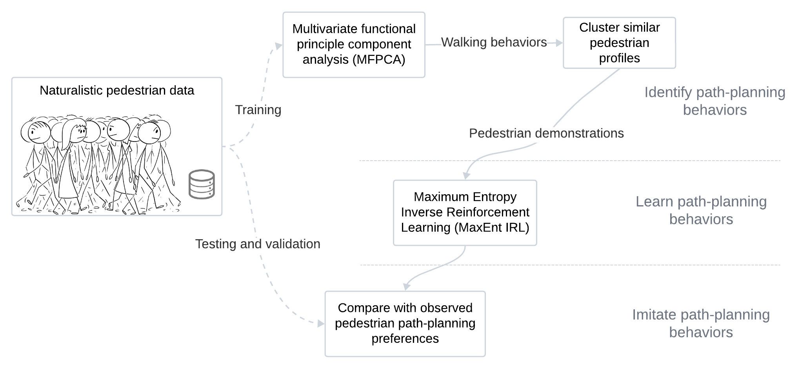
          <figcaption class = "image-caption">
            Generative Adversarial Imitation Learning (GAIL) of pedestrian path-planning in informal urban environments.
          </figcaption>
        </figure>
      </section>
    </div>
    
    <div class="image-column">
      <!-- Gallery for remaining images -->
      <div class="project-gallery">
        <div class="gallery-images" id="unreg-ped-gallery">
          <figure>
            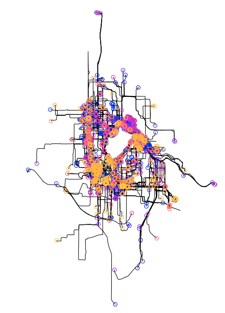
            <figcaption class = "image-caption">
              Graph-based RL environment for pedestrian preference learning at Greenlake, Seattle, WA.
            </figcaption>
          </figure>
          <figure>
            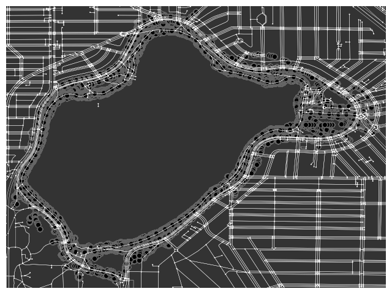
            <figcaption class = "image-caption">
              Weighting a step-size within a graph-based state space with historical collections of pedestrian walking activity.
            </figcaption>
          </figure>
        </div>
      </div>
    </div>
  </div>
</section>
```


```{=html}
<!-- Multimodal Environments Project -->
<section class="lab-section">
  <div class="two-column-layout">
    <div class="content-column">
      <section class="project-section">
        <h3 id="multimodal-envs">
          Multimodal Environments & Multitasking Driving Behaviors
          <a href="https://github.com/grackith/NRDT-engagement--mixed-traffic-settings" target="_blank" class="project-github">
            <i class="fab fa-github"></i>
          </a>
        </h3>
        <p><strong>Funded by: Federal Highway Administration (FHWA)</strong></p>

        <p>Drivers spend roughly half their time behind the wheel doing something other than driving. Using SHRP2 &mdash; the largest naturalistic driving study to date &mdash; this project examines how that plays out at 19 urban locations built for pedestrians and cyclists, combining cabin video, vehicle kinematics, and anonymized demographics.</p>

        <p>From 39,271 one-second observations of naturalistic crosswalk traversals, a Hidden Markov Model and Gaussian Mixture Model pipeline produced a typology of distracted driver behavior. The headline is a reframe: what separates safe from unsafe drivers is not <em>how often</em> they engage in a secondary task, but how responsively they disengage when the road demands it. Dynamic Bayesian networks map the conditional dependencies behind that, pointing at both infrastructure design and ADAS timing.</p>

        <p style="font-size: 0.9em;"><em>Accepted to Accident Analysis &amp; Prevention (2026).</em></p>
      </section>
    </div>
    
    <div class="image-column">
      <div class="project-gallery">
        <div class="gallery-images" id="multimodal-gallery">
          <figure>
            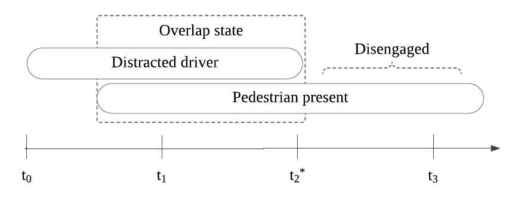
            <figcaption class="image-caption">Two operational measures are developed to describe driver NDRT engagement in the presence of vulnerable road users (VRUs): 1. an *overlap state*, and 2. a *disengagement point*.</figcaption>
          </figure>
          <figure>
            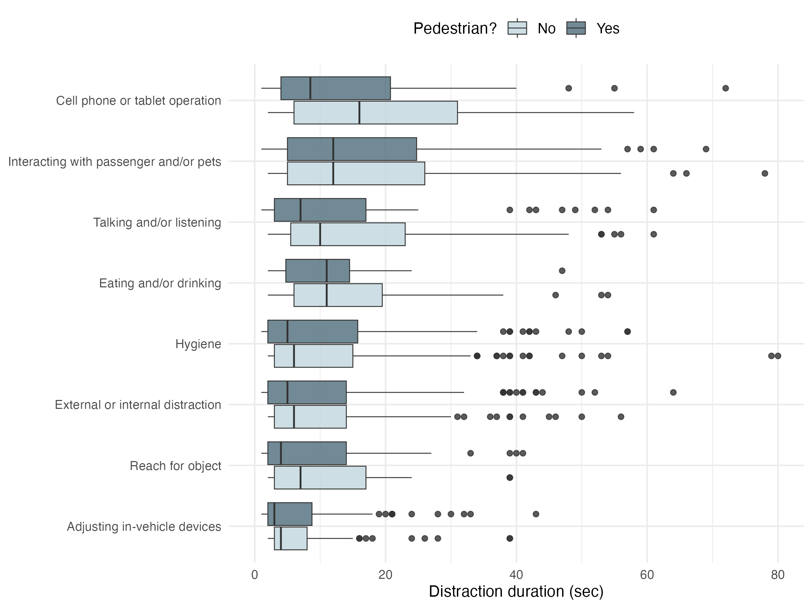
            <figcaption class="image-caption">Average duration of nondriving-related task (NDRT) engagement across 1,000+ driving traversals.</figcaption>
          </figure>
          <figure>
            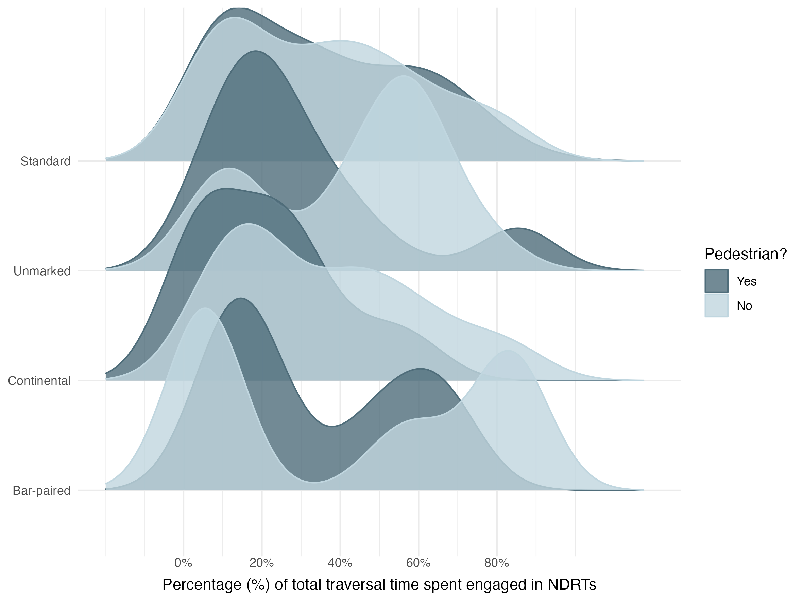
            <figcaption class="image-caption">Average proportion of driving traversal driver spent engaged in NDRTs. The bimodal distribution across VRU facilities suggest two driver distraction profiles: isolated engagement and serial engagement. The longest serial engagement observed spanned was 78% of the driver's trip.</figcaption>
          </figure>
        </div>
      </div>
    </div>
  </div>
</section>
```


```{=html}
<!-- Mode Choice Project -->
<section class="lab-section">
  <div class="two-column-layout">
    <div class="content-column">
      <section class="project-section">
        <h3 id="mode-choice">
          The Mode Choice Should be my Choice!
          <a href="https://github.com/grackith/sip-mode-flow" target="_blank" class="project-github">
            <i class="fab fa-github"></i>
          </a>
        </h3>
        <p>How much does the street itself decide how you travel? Using New York City as a living lab, this project pairs trip and mode-choice data from the <a href="https://www.nymtc.org/en-us/Data-and-Modeling/Travel-Surveys/Regional-Establishment-Survey">Regional Establishment Survey</a> with GIS-linked built environment features &mdash; high-visibility crosswalks, roadway width, slow-speed zones &mdash; from the <a href="https://opendata.cityofnewyork.us/">NYC Open Data Portal</a>.</p>

        <p>A mixed logit model compares individual heterogeneity across soft, mass, and personal-vehicle modes against how well the local environment actually supports the choice made, controlling for age, income, mobility status, and alternative-specific travel time. The interesting output is elasticity: how much mode share moves when the microenvironment changes.</p>
      </section>
    </div>
    
    <div class="image-column">
      <div class="project-gallery">
        <div class="gallery-images" id="mode-choice-gallery">
          <figure>
            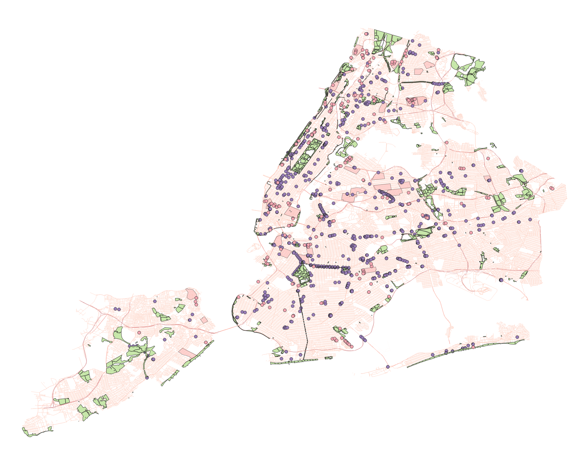
            <figcaption class="image-caption">NYC Open Data Portal tracks Vision Zero's <em>Street Improvement Projects</em>, which are safety and well-being solutions in historically risky urban areas. Some treatments: curb extensions (red circle), slow-speed zones (pink areas), enhanced crossings (purple circle), improved green space (green areas).</figcaption>
          </figure>
          <figure>
            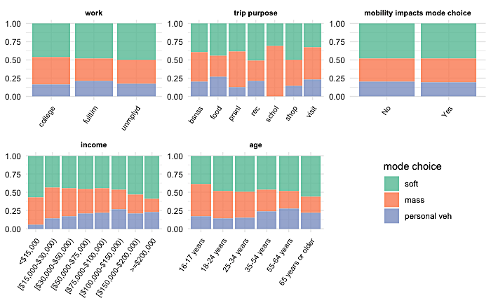
            <figcaption class="image-caption">Demographic profiles reveal mode choice differences among income, age and trip purpose.</figcaption>
          </figure>
        </div>
      </div>
    </div>
  </div>
</section>
```

```{=html}
<!-- Mobile Office Project -->
<section class="lab-section">
  <div class="two-column-layout">
    <div class="content-column">
      <section class="project-section">
        <h3 id="mobile-office">
          The Next Mobile Office: How will we Work in Self-Driving Cars?
          <a href="https://github.com/grackith?tab=repositories" target="_blank" class="project-github">
            <i class="fab fa-github"></i>
          </a>
        </h3>
        <p><strong>Funded by: National Science Foundation (NSF)</strong></p>
        <p>The promise of conditional automation is that you get your commute back as working time. This study tests what that costs. On the NADS miniSim, participants drive a two-lane rural road manually, then engage a Level 3 system and join a pre-recorded virtual meeting &mdash; discussing and revising slides, and fielding questions designed to pull them in.</p>

        <p>Then the car hands control back. Takeovers are assigned as either emergency or planned, and we measure the exchange in both directions: how deep meeting engagement delays takeover, and how a takeover wrecks meeting performance. Pre- and post-drive surveys track trust in the automation across the whole thing.</p>
      </section>
    </div>
    
    <div class="image-column">
      <div class="project-gallery">
        <div class="gallery-images" id="mobile-office-gallery">
          <figure>
            
            <figcaption class="image-caption">Researchers pre-record a virtual work meeting to select a slide deck.</figcaption>
          </figure>
          <figure>
            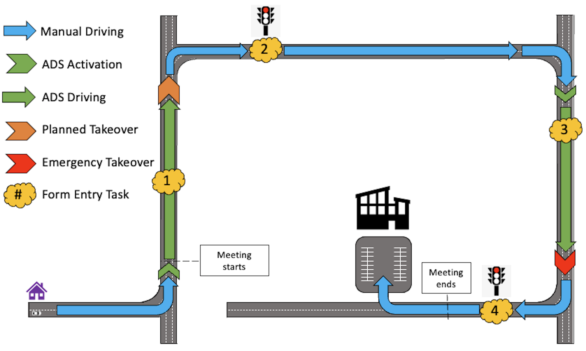
            <figcaption class="image-caption">A level 3 Automated Driving System (ADS) can conditionally take full control over the dynamic driving task. Participants are asked to begin the drive in manual operation, then join engage their ADS and join virtual meeting at their convenience.</figcaption>
          </figure>
        </div>
      </div>
    </div>
  </div>
</section>
```

```{=html}
<!-- Cross-Cultural Mapping Project -->
<section class="lab-section">
  <div class="two-column-layout">
    <div class="content-column">
      <section class="project-section">
        <h3 id="profile-mapping">
          Cross-cultural mapping of older drivers
          <a href="https://github.com/grackith?tab=repositories" target="_blank" class="project-github">
            <i class="fab fa-github"></i>
          </a>
        </h3>
        <p><strong>Funded by: National Science Foundation (NSF)</strong></p>
        <p>Naturalistic driving databases are slow and expensive to build, which makes cross-cultural comparison nearly impossible &mdash; nobody funds the same study twice on two continents. So instead of collecting a new one, we bridged two that already exist: the <a href="https://insight.shrp2nds.us/">SHRP2 naturalistic driving database</a> and the <a href="https://share-eric.eu/">Survey of Health, Aging, and Retirement in Europe</a>, matched on shared lifestyle, health, and personality characteristics.</p>

        <p>The resulting profiles show that an older driver's decision to keep driving is far less a medical threshold than a contextual one, shaped by where they live and what that place expects of them.</p>
      </section>
    </div>
    
    <div class="image-column">
      <div class="project-gallery">
        <div class="gallery-images" id="cross-cultural-gallery">
        <figure>
            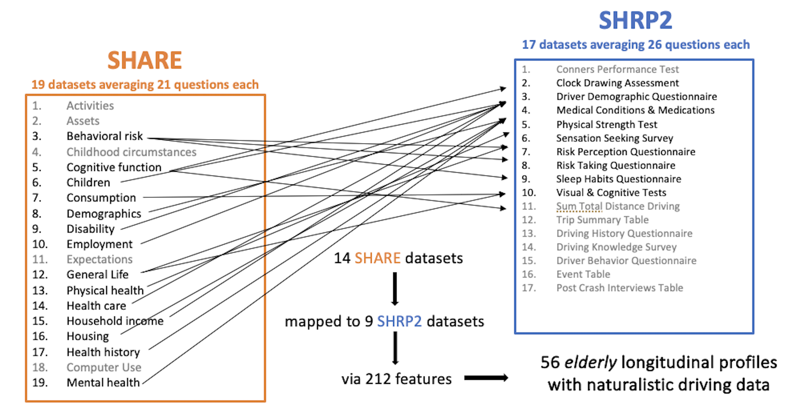
            <figcaption class="image-caption"> Mapping driving profiles across sociodemographics: how do older drivers navigate their decision to continue driving?</figcaption>
          </figure>
          <figure>
            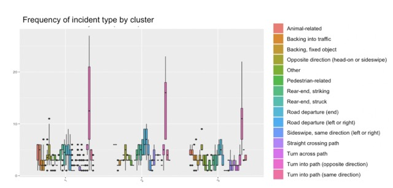
            <figcaption class="image-caption"> SHARE-SHRP2 mapping. Preliminary findings: Cluster 1: higher rates of other road user involved incidents. Cluster 2: highest rates of turning incidents. Cluster 3: highest rates of 'near-crashes'.</figcaption>
          </figure>
        </div>
      </div>
    </div>
  </div>
</section>
```

```{=html}
<!-- Pedestrian Exposure Devices Project -->
<section class="lab-section">
  <div class="two-column-layout">
    <div class="content-column">
      <section class="project-section">
        <h3 id="pedX">
          Measuring Pedestrian Exposure Using Electronic Devices
          <a href="https://github.com/grackith/dc-autoui2024" target="_blank" class="project-github">
            <i class="fab fa-github"></i>
          </a>
        </h3>
        <p><strong>Funded by: National Highway Traffic Safety Administration (NHTSA)</strong></p>
        <p>You cannot tell whether a corner is dangerous without knowing how many people walk it. That denominator &mdash; pedestrian exposure in a given <em>spatiotemporal slice</em> &mdash; is the missing term in most pedestrian safety work, and it is the reason a quiet street with one crash can look worse than a busy one with five.</p>

        <p>This project builds an exposure measure directly out of personal device data: GPS and accelerometer traces from more than 700 participants, each recorded for a week, collected over four years. The result is a framework for estimating who is actually at risk, at the scale countermeasures are designed for.</p>
      </section>
    </div>
    
    <div class="image-column">
      <div class="project-gallery">
        <div class="gallery-images" id="ped-devices-gallery">
          <figure>
            
            <figcaption class="image-caption"> Walking activity patterns in Seattle, WA from two NIH studies about health and wellness in urban infrastructure.</figcaption>
          </figure>
          <figure>
            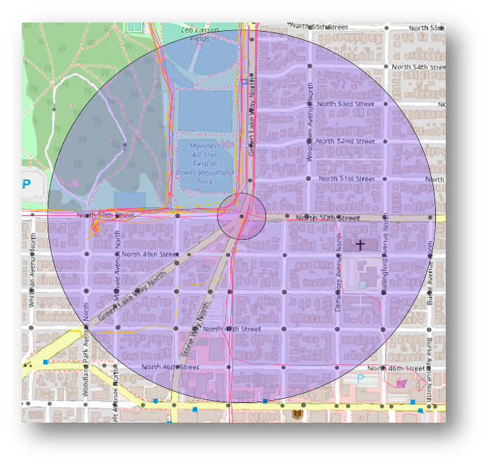
            <figcaption class="image-caption">Environmental buffer analysis to define levels of risk in micro-, meso-, and macro- pedestrian environments.</figcaption>
          </figure>
        </div>
      </div>
    </div>
  </div>
</section>
</div>
</div>
```
