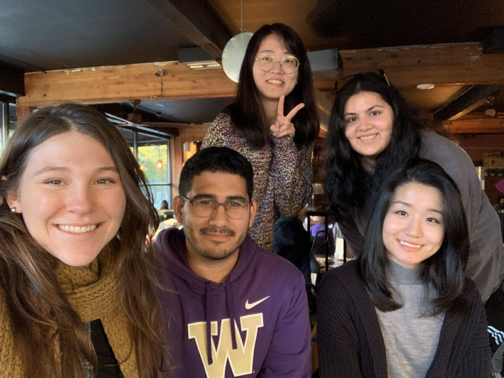

```{=html}
<div class="main-wrapper">
  <div class="content-wrapper">
    <!-- Timeline Section -->
    <section class="timeline-section">
      
    </section>

    <!-- Current Lab Section: HumanFUEL -->
    <section class="lab-section">
      <div class="two-column-layout">
        <!-- Left Column: Content -->
        <div class="content-column">
          <h4>Human Factors & Urban Ergonomics Lab (HumanFUEL) - New York University Tandon School of Engineering</h4>
          
          <p><strong>Advisor: <a href="https://scholar.google.com/citations?user=-iCRFrsAAAAJ&hl=en&oi=ao">Dr. Linda Ng Boyle</a> | Vice Dean of Research, NYU Tandon SOE - C2SMART Institute</strong></p>
          <p><em>September 2023 - Present</em></p>
          
          <p>Since moving to NYU in Fall 2023, and in addition to research on-going, I have also been involved with setting up the new lab:</p>
          <ul>
            <li>Ordering, installing, and calibrating new lab equipment: 2 vehicle simulators, 2 free-motion simulators, eye-tracking equipment, motion capture systems, LANs for real-time synchronization.</li>
            <li>Designing lab space for human subjects experiments, developing lab name and logo, and creating lab space use documentation.</li>
            <li>Coordinating with building managers, administration, technology manufacturers and equipment suppliers.</li>
            <li>Interviewing potential undergraduate and graduate candidates for research lab positions.</li>
          </ul>
        </div>
        <!-- Right Column: Logo -->
        <div class="image-column">
          <div class="sticky-images">
            <figure class="image-item">
              
              <figcaption class="image-caption">HumanFUEL Lab at NYU Tandon</figcaption>
            </figure>
          </div>
        </div>
      </div>
    </section>

    <!-- Previous Labs Section -->
    <section class="lab-section">
      <div class="two-column-layout">
        <!-- Left Column: Content -->
        <div class="content-column">
          <h4>University of Washington: Human Factors and Statistical Modeling Lab (HFSM) - </h4>
          <p><strong>Advisor: <a href="https://scholar.google.com/citations?user=-iCRFrsAAAAJ&hl=en&oi=ao">Dr. Linda Ng Boyle</a> | Professor, Chair, UW Industrial & Systems Engineering</strong></p>
          <p><em>June 2021 – August 2023</em></p>
          
          <p>Worked on multiple projects including:</p>
          <ul>
            <li>Cross-Cultural Mapping of Older Drivers</li>
            <li>Multimodal Environments & Multitasking Driving Behaviors</li>
            <li>Measuring Pedestrian Exposure Using Electronic Devices</li>
          </ul>

          <h4>University of Wisconsin-Madison: Cognitive Systems Lab (CSL)</h4>
          <p><strong>Advisor: <a href="https://scholar.google.com/citations?user=Qd6nZCAAAAAJ&hl=en">Dr. John Lee</a> | Professor, UW-Madison Industrial & Systems Engineering</strong></p>
          <p><em>May 2017 – August 2019</em></p>
          
          <ul>
            <li>Conducted an ethnographic study recording driver short-stop behavior at urban intersections using mounted GoPro cameras.</li>
            <li>Labeled vehicle-pedestrian interaction with ANVIL video coding software.</li>
            <li>Utilized NADs miniSim software for naturalistic driving environments.</li>
          </ul>
        </div>

        <!-- Right Column: Gallery -->
        <div class="image-column">
          <div class="project-gallery">
            <div class="gallery-images" id="previous-labs-gallery">
              <figure>
                
                <figcaption class="image-caption">Weekly coffee to canvas every coffee shop within 1 mile radius of the lab.</figcaption>
              </figure>
              <figure>
                
                <figcaption class="image-caption">Holiday celebrations 2023</figcaption>
              </figure>
              <figure>
                
                <figcaption class="image-caption">HFSM Lab at University of Washington</figcaption>
              </figure>
              <figure>
                
                <figcaption class="image-caption">Adventurous RAs take 2-wk trip to Virginia Tech Transportation Institute (VTTI) to hand-label sensitive driving video!</figcaption>
              </figure>
              <figure>
                
                <figcaption class="image-caption">CSL and HFSM celebration at the annual Human Factors & Ergonomics (HFES) Conference, 2022</figcaption>
              </figure>
            </div>
            <div class="gallery-nav" id="previous-labs-nav">
              <span class="gallery-dot"></span>
              <span class="gallery-dot"></span>
              <span class="gallery-dot"></span>
              <span class="gallery-dot"></span>
              <span class="gallery-dot"></span>
            </div>
          </div>
        </div>
      </div>
    </section>
  </div>
</div>

<script type="text/javascript">
document.addEventListener('DOMContentLoaded', () => {
  class ImageGallery {
    constructor(container) {
      this.gallery = container;
      this.figures = this.gallery.querySelectorAll('figure');
      this.nav = this.gallery.nextElementSibling;
      this.dots = this.nav.querySelectorAll('.gallery-dot');
      this.currentIndex = 0;
      
      this.showImage(0);
      this.setupEventListeners();
    }
    
    showImage(index) {
      if (index < 0 || index >= this.figures.length) return;
      
      this.figures.forEach(fig => {
        fig.style.display = 'none';
        fig.classList.remove('active');
      });
      
      this.figures[index].style.display = 'block';
      this.figures[index].classList.add('active');
      
      this.dots.forEach(dot => dot.classList.remove('active'));
      if (this.dots[index]) {
        this.dots[index].classList.add('active');
      }
      
      this.currentIndex = index;
    }
    
    setupEventListeners() {
      this.dots.forEach((dot, index) => {
        dot.addEventListener('click', () => this.showImage(index));
      });
      
      let touchStartX = 0;
      let touchEndX = 0;
      
      this.gallery.addEventListener('touchstart', (e) => {
        touchStartX = e.touches[0].clientX;
      }, { passive: true });
      
      this.gallery.addEventListener('touchend', (e) => {
        touchEndX = e.changedTouches[0].clientX;
        const swipeDistance = touchStartX - touchEndX;
        const swipeThreshold = 50;
        
        if (Math.abs(swipeDistance) > swipeThreshold) {
          if (swipeDistance > 0 && this.currentIndex < this.figures.length - 1) {
            this.showImage(this.currentIndex + 1);
          } else if (swipeDistance < 0 && this.currentIndex > 0) {
            this.showImage(this.currentIndex - 1);
          }
        }
      }, { passive: true });
    }
  }

  const galleries = document.querySelectorAll('.gallery-images');
  galleries.forEach(gallery => {
    new ImageGallery(gallery);
  });
});
</script>
```
