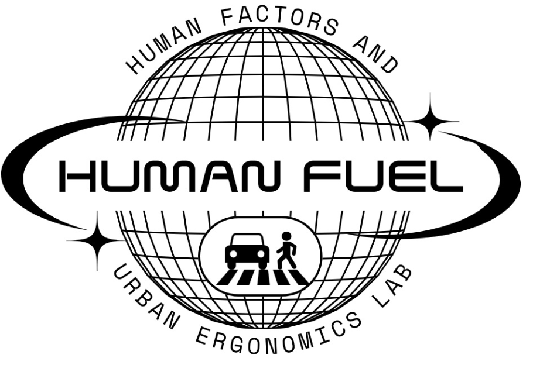
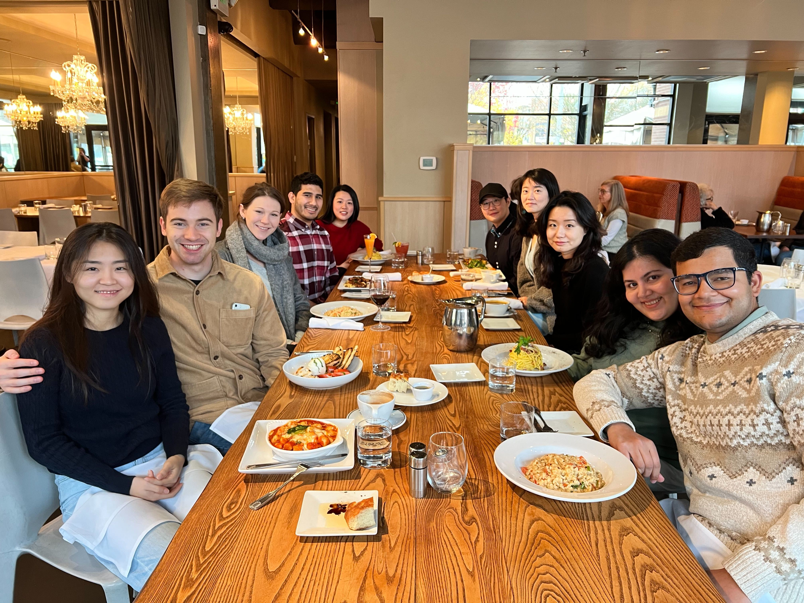
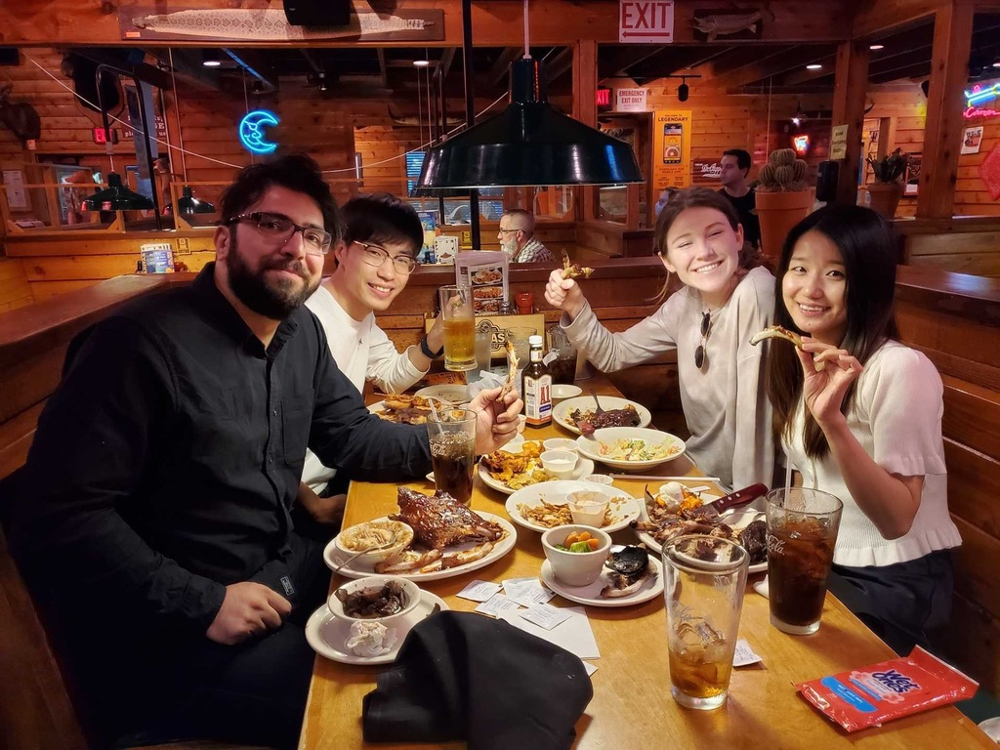

```{=html}
<div class="container-fluid px-0">
  <div class="row">
    <div class="col-12">
      
    </div>
  </div>
</div>
```


### Current Lab

```{=html}
<div class="container">
  <div class="row align-items-center">
    <div class="col-md-8">
      <h4>Human Factors & Urban Ergonomics Lab (HumanFUEL) -- NYU</h3>
      <p><strong>Advisor: Dr. Linda Ng Boyle | Vice Dean of Research, NYU Tandon SOE - C2SMART Institute</strong></p>
      <p><em>September 2023 - Present</em></p>
      <p>As a founding research lab member, I am involved in:</p>
      <ul>
        <li>Ordering, installing, and calibrating new lab equipment: 2 vehicle simulators, 2 free-motion simulators, eye-tracking equipment, motion capture systems, LANs for real-time synchronization.</li>
        <li>Designing lab space for human subjects experiments, developing lab name and logo, and creating lab space use documentation.</li>
        <li>Coordinating with building managers, administration, technology manufacturers and equipment suppliers.</li>
        <li>Interviewing potential undergraduate and graduate candidates for research lab positions.</li>
      </ul>
    </div>
    <div class="col-md-4 d-flex justify-content-center align-items-center">
      
    </div>
  </div>
</div>
```


### Previous Labs

#### Human Factors and Statistical Modeling Lab -- UW
**Advisor: Dr. Linda Ng Boyle | Professor, Chair, UW Industrial & Systems Engineering**

*June 2021 – August 2023*

Worked on multiple projects including Cross-Cultural Mapping of Older Drivers, Multimodal Environments & Multitasking Driving Behaviors, and Measuring Pedestrian Exposure Using Electronic Devices.

::: row
::: {.col-md-4 .img-container}
{.img-fluid .rounded}
:::

::: {.col-md-4 .img-container}
{.img-fluid .rounded}
:::
::: {.col-md-4 .img-container}
{.img-fluid .rounded}
:::

:::

#### Cognitive Systems Lab -- UW-Madison
**Advisor: Dr. John Lee | Professor, UW-Madison Industrial & Systems Engineering**

*May 2017 – August 2019*

- Conducted an ethnographic study recording driver short-stop behavior as a communication tool in uncontrolled multimodal environments.
- Labeled vehicle-pedestrian interaction with ANVIL video coding software, modeled proxemics and kinesics cues in R.
- Utilized NADs miniSim software for naturalistic driving environments to validate short-stop vehicle deceleration profiles.

