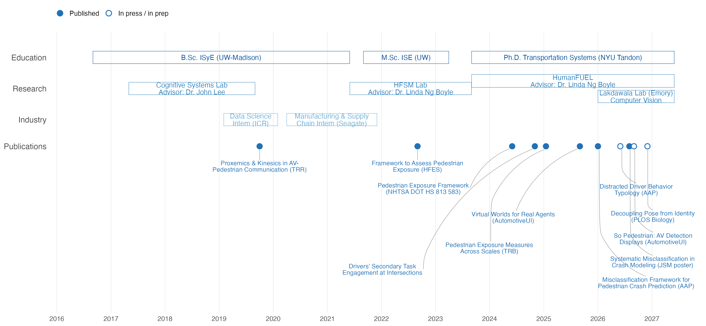
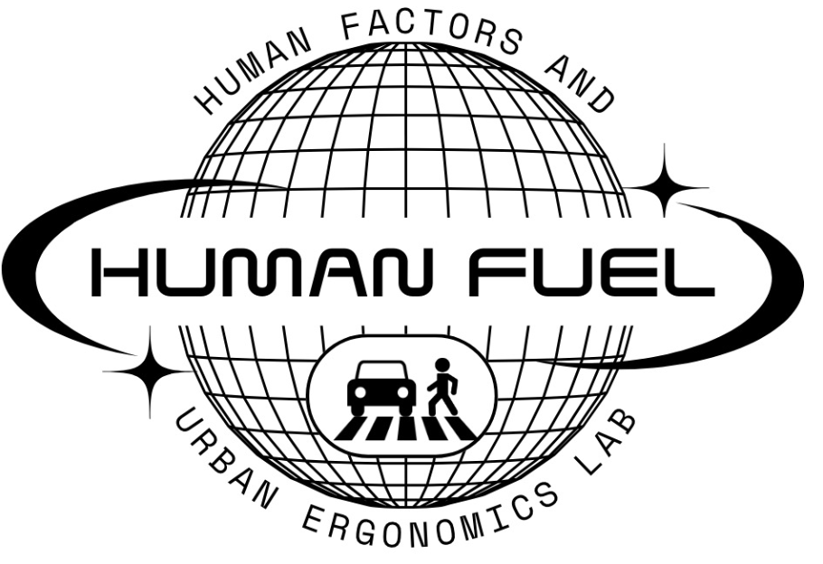
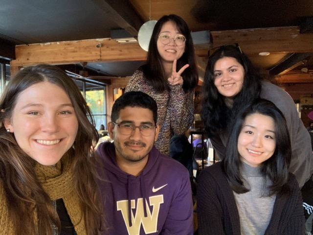
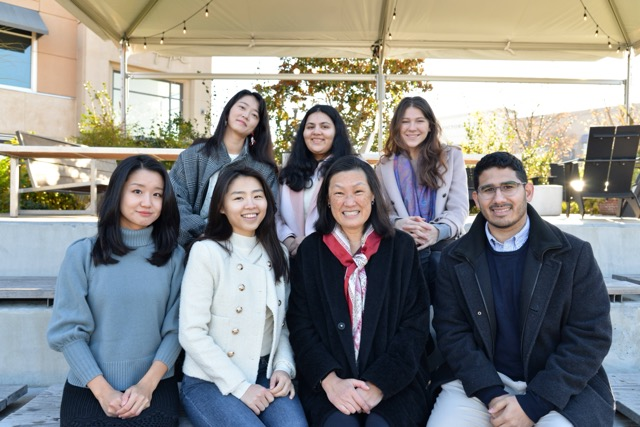
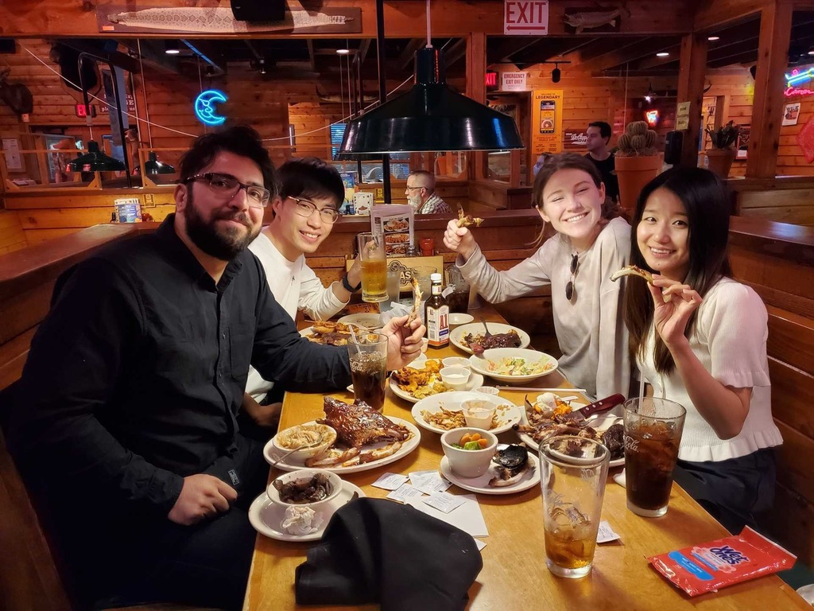
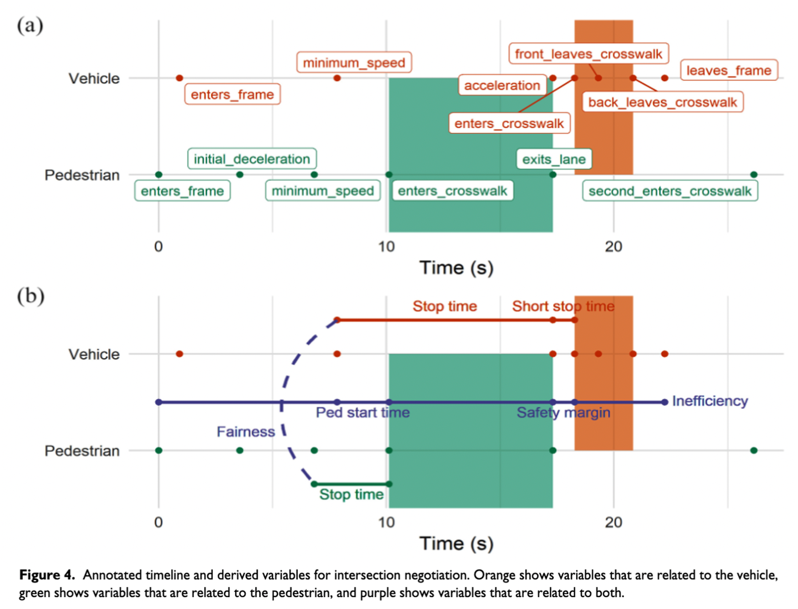

```{=html}
<div class="main-wrapper">
  <div class="content-wrapper">
    <section class="lab-section">
      <div class="intro-box">
       <div class="intro-box-title">
         <span class="emoji">🌎</span>WHERE ARE YOU FROM?
       </div>
       <div class="intro-box-content" style="--n:382;">
Experiences and environments we are exposed to is fundamental to who we become and how we behave (<span class="italic">observational learning</span>, <span class="italic">Bandura's Bobo Doll experiment</span><span class="superscript">1</span>). Below is a timeline of the professional environments I've been exposed to, and research conducted in these spaces.
       </div>
      </div>
    <!-- Timeline Section -->
    <section class="timeline-section">
      <div class="timeline-scroll">
        <a href="images/timeline.png" target="_blank" rel="noopener">
          
        </a>
      </div>
      <p class="timeline-hint">Swipe to pan &middot; tap the timeline to open it full size</p>
    </section>
    </section>
```

```{=html}
<!-- Current Lab Section: HumanFUEL -->
<section class="lab-section">
  <div class="lab-section-split">
    <!-- Top section with two columns -->
    <div class="lab-section-top">
      <!-- Left Column: Content -->
      <div class="content-column">
        <h4>NYU Tandon School of Engineering: Human Factors & Urban Ergonomics Lab (HumanFUEL)</h4>
        
        <p><strong>Advisor: <a href="https://scholar.google.com/citations?user=-iCRFrsAAAAJ&hl=en&oi=ao">Dr. Linda Ng Boyle</a> | Vice Dean of Research, NYU Tandon SOE - C2SMART Institute</strong></p>
        <p><em>September 2023 - Present</em></p>
        
        <ul>
          <li><a href="projects.html#virtual-worlds">Virtual Worlds for Real Agents: Validating VR Pedestrian Behavior</a> <em>(dissertation)</em></li>
          <li><a href="projects.html#eyes-up">Eyes Up! Egocentric Collections of Pedestrian Decision-Making</a> <em>(dissertation)</em></li>
          <li><a href="projects.html#so-pedestrian">So Pedestrian: Detection Displays in Automated Vehicles</a></li>
          <li><a href="projects.html#ped-study">Pedestrian Exposure for Crash Prediction</a></li>
          <li><a href="projects.html#sim2real">SIM-2-SIM: Virtualized mixed-traffic driving environments with human regulated RL agents</a></li>
          <li><a href="projects.html#unregulated-ped">JAYWALK: Unregulated pedestrian behavior in mixed-traffic driving environments</a></li>
          <li><a href="projects.html#mode-choice">The Mode Choice Should be my Choice!</a></li>
        </ul>
      </div>
      
      <!-- Right Column: Logo -->
      <div class="image-column">
        <div class="sticky-images">
          <figure class="image-item">
            
            <figcaption class="image-caption"> </figcaption>
          </figure>
        </div>
      </div>
    </div>

    <!-- Bottom section in single column -->
    <div class="lab-section-bottom">
      <p>Since moving to NYC at the beginning of 2024, I have also been involved with setting up the new lab:</p>
      <ul>
        <li>Ordering, installing, and calibrating new lab equipment: <a href="hardware.html#veh-sim-header">2 vehicle simulators</a>, <a href="hardware.html#free-sim-header">2 free-motion simulators</a>, <a href="hardware.html#mocap-header">2 motion capture systems</a>, <a href="hardware.html#network">LANs for real-time synchronization</a>.</li>
        <li>Designing lab space for human subjects experiments, developing lab name and logo, and creating lab space use documentation.</li>
        <li>Coordinating with building managers, administration, technology manufacturers and equipment suppliers.</li>
        <li>Interviewing potential undergraduate and graduate candidates for research lab positions.</li>
      </ul>
    </div>
  </div>
</section>
```

```{=html}
<!-- Lakdawala Lab, Emory -->
<section class="lab-section">
  <div class="two-column-layout">
    <div class="content-column">
      <h4>Emory University School of Medicine: Lakdawala Lab</h4>
      <p><strong>Research Scientist, Computer Vision | PI: <a href="https://med.emory.edu/departments/microbiology-immunology/research/lakdawala-lab/index.html" target="_blank" rel="noopener">Dr. Seema Lakdawala</a></strong></p>
      <p><em>January 2026 - Present</em></p>
      <ul>
        <li>Pose estimation and identity tracking for dye-marked ferrets under dense occlusion in influenza-transmission studies (<a href="FUN.html">more here</a>).</li>
        <li>Decoupled identity from pose with SLEAP creator Dr. Talmo Pereira: Random Forest HSV classifier with Hungarian matching.</li>
        <li>Confidence- and margin-gated assignment abstains rather than guessing, so occlusion swaps cannot propagate.</li>
        <li>Architected the AWS GPU pipeline (EC2/S3, sleap-nn/PyTorch/CUDA): ~1.5 h per 2 h video, streaming at flat memory.</li>
      </ul>
    </div>
    <div class="image-column">
      <figure style="margin: 0;">
        <video class="autoloop" muted loop playsinline controls preload="metadata"
               style="width: 100%; height: auto; max-height: 380px; object-fit: contain;">
          <source src="videos/sleap-ferret-tracking.mp4" type="video/mp4">
          Your browser does not support the video tag.
        </video>
        <figcaption class="image-caption">Multi-animal pose and identity tracking.</figcaption>
      </figure>
    </div>
  </div>
</section>
```

```{=html}
<!-- HFSM Lab -->
<section class="lab-section">
  <div class="two-column-layout">
    <div class="content-column">
      <h4>University of Washington: Human Factors and Statistical Modeling Lab (HFSM)</h4>
      <p><strong>Advisor: <a href="https://scholar.google.com/citations?user=-iCRFrsAAAAJ&hl=en&oi=ao">Dr. Linda Ng Boyle</a> | Professor, Chair, UW Industrial & Systems Engineering</strong></p>
      <p><em>June 2021 – August 2023</em></p>
      <ul>
        <li><a href="projects.html#mobile-office">The Next Mobile Office: How will we Work in Self-Driving Cars?</a></li>
        <li><a href="projects.html#multimodal-envs">Multimodal Environments & Multitasking Driving Behaviors</a></li>
        <li><a href="projects.html#profile-mapping">Cross-cultural mapping of older drivers</a></li>
        <li><a href="projects.html#pedX">Measuring Pedestrian Exposure Using Electronic Devices</a></li>
      </ul>
    </div>

    <div class="image-column">
      <div class="project-gallery">
        <div class="gallery-images" id="hfsm-gallery">
          <figure>
            
            <figcaption class="image-caption">Weekly coffee to canvas every coffee shop within 1 mile radius of the lab.</figcaption>
          </figure>
          <figure>
            
            <figcaption class="image-caption">Holiday celebrations 2023</figcaption>
          </figure>
          <figure>
            
            <figcaption class="image-caption">HFSM Lab at University of Washington</figcaption>
          </figure>
          <figure>
            
            <figcaption class="image-caption">Adventurous RAs take 2-wk trip to Virginia Tech Transportation Institute (VTTI) to hand-label sensitive driving video!</figcaption>
          </figure>
        </div>
      </div>
    </div>
  </div>
</section>
```

```{=html}
<!-- CSL Lab -->
<section class="lab-section">
  <div class="two-column-layout">
    <div class="content-column">
      <h4>University of Wisconsin-Madison: Cognitive Systems Lab (CSL)</h4>
      <p><strong>Advisor: <a href="https://scholar.google.com/citations?user=Qd6nZCAAAAAJ&hl=en">Dr. John Lee</a> | Professor, UW-Madison Industrial & Systems Engineering</strong></p>
      <p><em>May 2017 – August 2019</em></p>
      
      <ul>
        <li>Conducted an ethnographic study recording driver short-stop behavior at urban intersections.</li>
        <li>Labeled vehicle-pedestrian interaction with ANVIL video coding software.</li>
        <li>Utilized NADs miniSim software for naturalistic driving environments.</li>
      </ul>
    </div>
    
    <div class="image-column">
      <div class="project-gallery">
        <div class="gallery-images" id="csl-gallery">
          <figure>
            
            <figcaption class="image-caption">
              Drivers 'short-stop' as a type of nonverbal communication to vulnerable pedestrians. Spatiotemporal traces of mixed-traffic behavior helps identify mechanisms of informal interaction in shared spaces.
            </figcaption>
          </figure>
          <figure>
            
            <figcaption class="image-caption">
              CSL and HFSM celebration at the annual Human Factors & Ergonomics (HFES) Conference, 2022
            </figcaption>
          </figure>
        </div>
      </div>
    </div>
  </div>
</section>
</div>
<div class="footnotes">
      <p><sup>1</sup>Bandura, A., Ross, D., & Ross, S. A. (1963). Imitation of film-mediated aggressive models. The Journal of Abnormal and Social Psychology, 66(1), 3–11. https://psycnet.apa.org/record/1963-00856-001</p>
</div>
</div>
```
